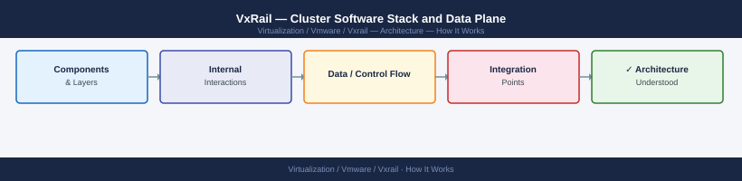
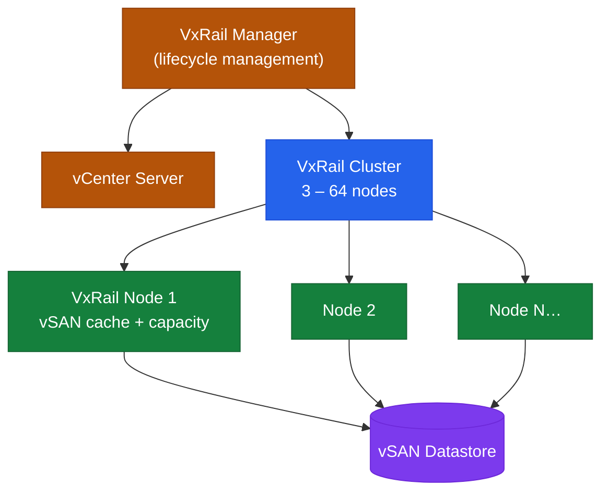

---
tags:
  - architecture
  - vxrail
---
# VxRail — Cluster Software Stack and Data Plane



```d2
direction: right

center: "VxRail" {shape: hexagon}
hci_node_cluster: "HCI Node Cluster" {shape: rectangle}

center -> hci_node_cluster
```

## Overview

VxRail is a hyper-converged infrastructure (HCI) appliance built on Dell PowerEdge nodes running VMware vSphere and vSAN. Each node contributes local compute (CPU, RAM), NVMe flash cache, and capacity storage to a unified cluster. VxRail Manager orchestrates all lifecycle and configuration operations by communicating with vCenter.

VxRail is sold exclusively as a pre-configured appliance and managed as a system — firmware updates, vSphere upgrades, and vSAN configuration changes all go through the VxRail Manager lifecycle workflow, never independently.

## HCI Node Cluster




## See also

- [VxRail — Design Standards](../design-standards/)
- [VxRail — Deploy](../../deploy/)
- [VxRail — Integrations](../integrations/)
