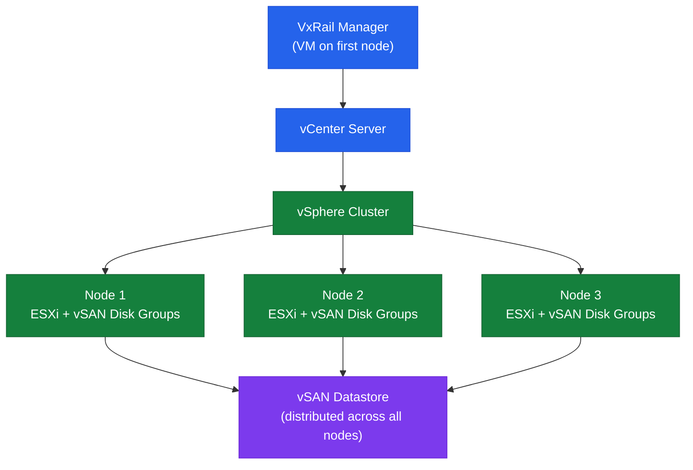

# VxRail — Architecture

Dell VxRail is an HCI appliance built on vSphere and vSAN. VxRail Manager orchestrates lifecycle upgrades as a single tested bundle (ESXi + vCenter + vSAN + firmware). All storage is vSAN-based — no external shared storage in a standard deployment.

<a class="kb-card" href="how-it-works/"><strong>How It Works</strong>Cluster topology, node families, vSAN integration, network design, deployment models, and VxRail Manager API.</a>
<a class="kb-card" href="integrations/"><strong>Integrations</strong>vCenter plugin, Dell support APIs, Aria Operations, and external system integrations.</a>
<a class="kb-card" href="design-standards/"><strong>Design Standards</strong>Naming conventions, network design rules, and configuration baselines.</a>

---

## Key Components

| Component | Purpose |
|---|---|
| VxRail Manager | Cluster lifecycle, expansion, LCM orchestration; deployed as a VM |
| vCenter Server | vSphere cluster management — embedded or customer-provided external |
| vSAN | Distributed storage layer; all node storage pooled into one vSAN datastore |
| iDRAC | Dell OOB management on each node; used by VxRail for hardware health |
| VxRail LCM | Orchestrates bundles of ESXi + vCenter + firmware updates |

---

## Architecture Overview

