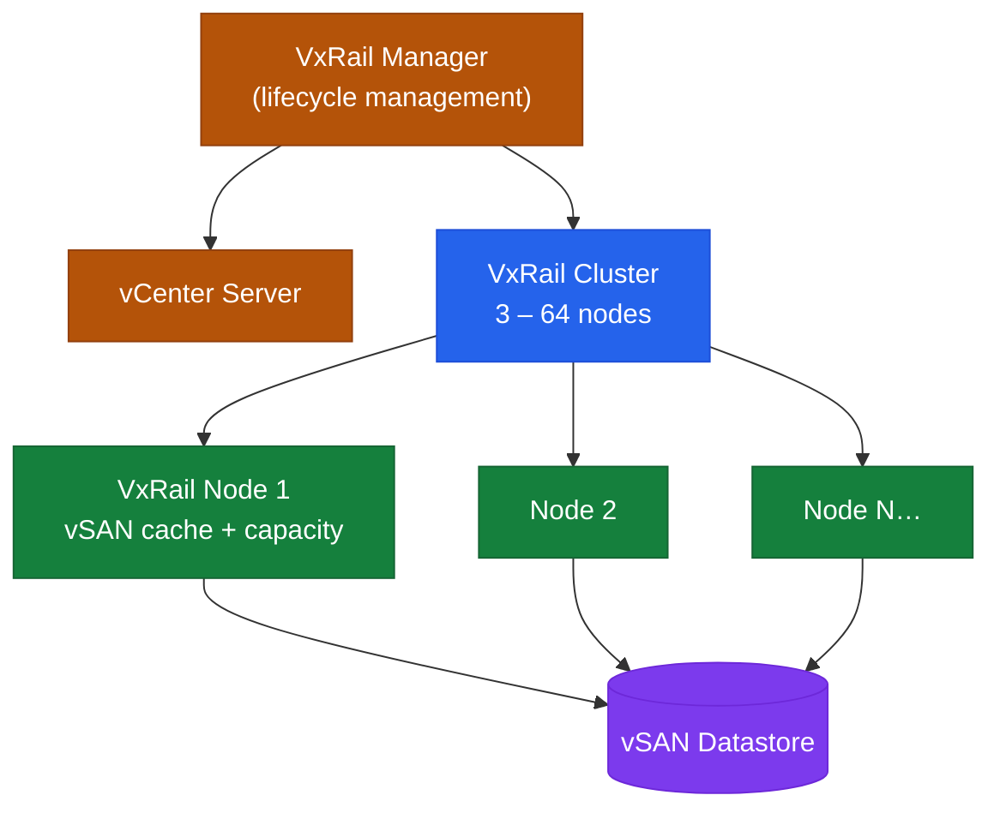

---
tags:
  - architecture
  - vxrail
---
# VxRail — Architecture

<div class="kb-summary">
VxRail architecture overview — node hardware, HCI cluster topology, vSAN disk groups, and management stack integration.

*Applies to: VxRail 7.x · 8.x*
</div>

```text
┌───────────────────────────── Virtualization Vmware Vxrail — Architecture ─────────────────────────────┐
│                                                                                                       │
│   ┌───────────────────────────────────────────────────────────────────────────────────────────────┐   │
│   │              Vmware architecture overview: Virtualization Vmware Vxrail platform              │   │
│   │                                  Protocols: Various protocols                                 │   │
│   │        Key components: Virtualization Vmware Vxrail, Management, Monitoring, Automation       │   │
│   │          Design principles: HA, scalability, non-disruptive operations, and security          │   │
│   └───────────────────────────────────────────────────────────────────────────────────────────────┘   │
│                                                                                                       │
│    Design → deploy → configure → validate → monitor → optimise                                        │
│                                                                                                       │
│                  ▼                                ▼                                ▼                  │
│                                                                                                       │
│   ┌─────────────────────────────┐  ┌─────────────────────────────┐  ┌─────────────────────────────┐   │
│   │            Layer            │  │          Component          │  │            Notes            │   │
│   │             Core            │  │       Primary service       │  │        Main function        │   │
│   │          Management         │  │        Control plane        │  │         Admin access        │   │
│   │          Monitoring         │  │         Health/perf         │  │      Alerts/dashboards      │   │
│   │           Security          │  │         Auth/encrypt        │  │        Access control       │   │
│   │         Integration         │  │        APIs/plug-ins        │  │         Third-party         │   │
│   └─────────────────────────────┘  └─────────────────────────────┘  └─────────────────────────────┘   │
│                                                                                                       │
│                          ▼                                                 ▼                          │
│                                                                                                       │
│   ┌───────────────────────────────────────────────────────────────────────────────────────────────┐   │
│   │      Layer       │    Component     │      Function     │      Notes       │       Auth       │   │
│   │       Core       │ Primary service  │   Main function   │     See docs     │       RBAC       │   │
│   │    Management    │  Control plane   │    Admin access   │     See docs     │       RBAC       │   │
│   │    Monitoring    │   Health/perf    │  Alerts/dashboard │     See docs     │       RBAC       │   │
│   │     Security     │   Auth/encrypt   │   Access control  │     See docs     │       RBAC       │   │
│   └───────────────────────────────────────────────────────────────────────────────────────────────┘   │
│                                                                                                       │
│    Physical: Virtualization Vmware Vxrail infrastructure · management network · monitoring            │
│                                                                                                       │
│    Key terms:                                                                                         │
│                                                                                                       │
│    Vmware             = Virtualization Vmware Vxrail platform overview and core concepts              │
│    Management         = management console and command-line interface for administration              │
│    Monitoring         = health and performance monitoring dashboards and alerting                     │
│    Automation         = REST API, scripting, and pipeline integration capabilities                    │
│    Security           = access control, authentication, and encryption configuration                  │
│    Backup             = backup and recovery procedures and schedule configuration                     │
│    Upgrade            = software version upgrades and firmware patching procedures                    │
│    Troubleshooting    = diagnostic procedures and common issue resolution steps                       │
│    Escalation         = vendor support escalation path and severity triage process                    │
│    Documentation      = vendor knowledge base and official product documentation                      │
│    Change management  = change ticket requirements for production modifications                       │
│    Audit log          = admin action logging for compliance and security review                       │
│                                                                                                       │
└───────────────────────────────────────────────────────────────────────────────────────────────────────┘
```


<div class="kb-grid kb-grid-3">
<a class="kb-card" href="how-it-works/"><strong>How It Works</strong><span>How it works, integrations, and design standards.</span></a>
<a class="kb-card" href="../integration/"><strong>Integration</strong><span>Integration with vCenter, NSX, Aria Operations, and Dell SupportAssist.</span></a>
<a class="kb-card" href="../design-standards/"><strong>Design Standards</strong><span>Sizing, VMkernel network design, vSAN policy, and cluster configuration best practices.</span></a>
</div>

## Cluster Topology

| Parameter | Value |
|---|---|
| Minimum cluster size | 3 nodes (FTT=1 vSAN RAID-1 or RAID-5 with 4+ nodes) |
| Maximum cluster size | 64 nodes |
| Node types | All-flash, NVMe, hybrid (spinning + cache tier) |
| Dedicated management nodes | Optional — separate nodes for vCenter and management VMs |
| Stretched cluster | 2 data sites + 1 witness; requires stretched vSAN |

## HCI Node Cluster


