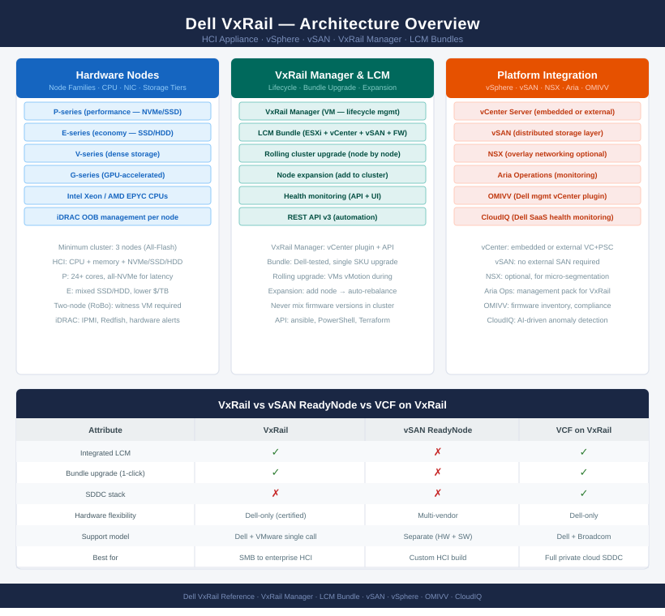

# VxRail — Architecture

<div class="kb-summary">
Dell VxRail is an HCI appliance built on vSphere and vSAN. VxRail Manager orchestrates lifecycle upgrades as a single tested bundle (ESXi + vCenter + vSAN + firmware). All storage is vSAN-based — no external shared storage in a standard deployment.
</div>



<div class="kb-grid kb-grid-3">
<a class="kb-card" href="how-it-works/"><strong>How It Works</strong><span>Cluster topology, node families, vSAN integration, network design, deployment models, and VxRail Manager API.</span></a>
<a class="kb-card" href="integrations/"><strong>Integrations</strong><span>vCenter plugin, Dell support APIs, Aria Operations, and external system integrations.</span></a>
<a class="kb-card" href="design-standards/"><strong>Design Standards</strong><span>Naming conventions, network design rules, and configuration baselines.</span></a>
</div>

---

## Key Components

| Component | Purpose |
|---|---|
| VxRail Manager | Cluster lifecycle, expansion, LCM orchestration; deployed as a VM |
| vCenter Server | vSphere cluster management — embedded or customer-provided external |
| vSAN | Distributed storage layer; all node storage pooled into one vSAN datastore |
| iDRAC | Dell OOB management on each node; used by VxRail for hardware health |
| VxRail LCM | Orchestrates bundles of ESXi + vCenter + firmware updates |

---

## Architecture Overview

```
┌──────────────────────────────────────── VxRail — Architecture ────────────────────────────────────────┐
│                                                                                                       │
│   ┌───────────────────────────────────────────────────────────────────────────────────────────────┐   │
│   │        VxRail = Dell EMC HCI appliance running VMware ESXi + vSAN + vCenter (embedded)        │   │
│   │    VxRail Manager provides unified lifecycle management via REST API and plugin in vCenter    │   │
│   │    Node families: P-series (general), E-series (entry), V-series (vSAN ESA), G-series (GPU)   │   │
│   │     Supports stretched clusters and VCF integration for full software-defined data centre     │   │
│   │  LCM bundles upgrade FW + ESXi + vSAN together per node; VxRail Manager orchestrates sequence │   │
│   └───────────────────────────────────────────────────────────────────────────────────────────────┘   │
│                                                                                                       │
│    How-it-works defines HCI mechanics · integrations connect vCenter and Dell tools                   │
│                                                                                                       │
│                  ▼                                ▼                                ▼                  │
│                                                                                                       │
│   ┌─────────────────────────────┐  ┌─────────────────────────────┐  ┌─────────────────────────────┐   │
│   │         How It Works        │  │         Integrations        │  │       Design Standards      │   │
│   │     HCI: ESXi+vSAN+vCtr     │  │        vCenter plugin       │  │      Cluster 3-64 nodes     │   │
│   │        VxRail Mgr API       │  │          Dell OMIVV         │  │        VMk VLAN plan        │   │
│   │       LCM unified upg       │  │        iDRAC hardware       │  │        iDRAC OOB VLAN       │   │
│   │    Node families P/E/V/G    │  │       Aria Ops adapter      │  │       LCM bundle match      │   │
│   │        vSAN stretched       │  │        SupportAssist        │  │          FTT policy         │   │
│   │        VxRail on VCF        │  │      CloudIQ monitoring     │  │        Witness sizing       │   │
│   └─────────────────────────────┘  └─────────────────────────────┘  └─────────────────────────────┘   │
│                                                                                                       │
│    How-it-works covers HCI stack · integrations connect Dell and VMware tools                         │
│                                                                                                       │
│                  ▼                                ▼                                ▼                  │
│                                                                                                       │
│   ┌───────────────────────────────────────────────────────────────────────────────────────────────┐   │
│   │   How It Works   │   Integrations   │    Design Stds    │    Deployment    │     Key Stds     │   │
│   │  VxRail Mgr API  │  vCenter plugin  │     3-64 nodes    │  3-node starter  │    VLAN plan     │   │
│   │  LCM lifecycle   │    Dell OMIVV    │     VMk VLANs     │   4+ stretched   │    FTT policy    │   │
│   │  Node families   │     iDRAC HW     │     iDRAC OOB     │    VCF ready     │  Witness sizing  │   │
│   │  vSAN stretched  │     Aria Ops     │     LCM bundle    │    Scale-out     │    BOM match     │   │
│   └───────────────────────────────────────────────────────────────────────────────────────────────┘   │
│                                                                                                       │
│  Physical Infrastructure (the hardware everything above runs on):                                     │
│  Dell PowerEdge servers · NVMe/SSD/HDD drives · 25GbE NICs · iDRAC OOB · ToR switches                 │
│                                                                                                       │
│  Key terms:                                                                                           │
│                                                                                                       │
│  VxRail Manager    = Embedded VM on the cluster; provides REST API and vCenter plugin for HCI         │
│  OMIVV             = OpenManage Integration for VMware vCenter; surfaces Dell hardware alerts in      │
│  LCM               = Lifecycle Manager; orchestrates FW + ESXi + vSAN upgrade as a single bundle      │
│  HCI               = Hyperconverged Infrastructure; compute, storage, and networking in a single      │
│  iDRAC             = Integrated Dell Remote Access Controller; OOB management for hardware health and │
│  SupportAssist     = Dell proactive support service; auto-creates cases on hardware alert detection   │
│  CloudIQ           = Dell SaaS monitoring platform; capacity, performance, and health tracking for    │
│  VxRail bundle     = Signed LCM package containing matched FW, ESXi, and vSAN component versions      │
│  FTT               = Failures to Tolerate; vSAN policy defining how many host/disk failures data can  │
│  P/E/V/G-series    = VxRail node families: P=general, E=entry, V=vSAN ESA NVMe, G=GPU-accelerated     │
│  Stretched cluster = VxRail cluster spanning two sites with a witness VM for quorum and zero RPO      │
│  VCF on VxRail     = VMware Cloud Foundation deployed on VxRail hardware using Dell-managed LCM       │
│                                                                                                       │
└───────────────────────────────────────────────────────────────────────────────────────────────────────┘
```
