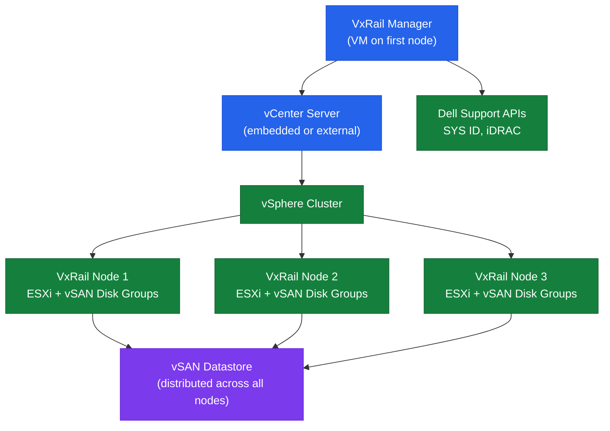

# VxRail — Architecture

## What is VxRail

Dell VxRail is a hyper-converged infrastructure (HCI) appliance that combines compute, storage, and networking in a pre-integrated, factory-configured unit. VxRail is built on VMware vSphere and vSAN, and is exclusively managed through the VxRail Manager plugin within vCenter. Every VxRail cluster runs vSAN as its storage layer — there is no shared external storage in a standard VxRail deployment.

VxRail is a jointly engineered product between Dell Technologies and Broadcom (VMware). Software lifecycle is managed through Dell's VxRail Lifecycle Manager (LCM), which orchestrates updates to ESXi, vCenter, vSAN, and hardware firmware as a single bundle.

---

## Architecture Overview



### Key Components

| Component | Purpose |
|---|---|
| **VxRail Manager** | Cluster lifecycle, expansion, LCM orchestration; deployed as a VM |
| **vCenter Server** | vSphere cluster management — embedded or customer-provided external |
| **vSAN** | Distributed storage layer; all node storage pooled into one vSAN datastore |
| **iDRAC** | Dell out-of-band management on each node; used by VxRail for hardware health |
| **VxRail LCM** | Lifecycle Manager; orchestrates bundles of ESXi + vCenter + firmware updates |

---

## Node Architecture

Each VxRail node is a Dell PowerEdge server configured at the factory to run ESXi. Nodes are available in multiple hardware families:

| VxRail Family | Platform | Form Factor | Typical Use |
|---|---|---|---|
| E Series | PowerEdge R750/R650 | 2U | General compute; All-Flash or Hybrid |
| P Series | PowerEdge R750 | 2U | Performance-optimised; All-Flash |
| V Series | PowerEdge R750 | 2U | vSAN Ready Node variant |
| G Series | PowerEdge R750/R450 | 1U/2U | Graphics / GPU workloads |
| S Series | PowerEdge R450/R350 | 1U | Storage-dense configurations |
| D Series | PowerEdge DSS | Dense | High-density rack configurations |

### Node Internal Components

| Component | Description |
|---|---|
| CPU | 1 or 2 Intel Xeon Scalable processors |
| Memory | ECC DDR5 (Gen 14/15 nodes); configured to VxRail sizing spec |
| Cache Tier | NVMe SSD (required for Hybrid vSAN; optional for All-Flash) |
| Capacity Tier | NVMe SSD (All-Flash) or SAS/SATA HDD (Hybrid) |
| Boot Device | M.2 SD card or M.2 NVMe (not part of vSAN disk groups) |
| NICs | 2x 10/25GbE or 4x 10/25GbE per node; model-dependent |
| iDRAC | Dedicated OOB management port on each node |

---

## vSAN Integration

VxRail storage is entirely vSAN-based. vSAN pools local disks across all nodes into a shared distributed datastore that all VMs use.

### Disk Group Design

Each VxRail node contributes one or more vSAN disk groups to the cluster. A disk group consists of:

- **Cache disk**: NVMe SSD (write cache + read buffer)
- **Capacity disks**: NVMe SSDs or HDDs (where data is actually stored)

vSAN ESA (Express Storage Architecture), available on newer VxRail models, uses a single-tier NVMe design without a separate cache disk.

```bash
# View disk groups on a node (SSH to ESXi host)
esxcli vsan storage list | grep -E "Disk Group|Is SSD|Device:"

# From vCenter:
# Cluster → Configure → vSAN → Disk Management
```

### vSAN Policies and FTT

VxRail uses vSAN storage policies to define how many failures can be tolerated per VM object:

| Policy | FTT | Minimum Nodes | Data Copies |
|---|---|---|---|
| RAID-1 (Mirroring), FTT=1 | 1 host failure | 3 nodes | 2 copies |
| RAID-1 (Mirroring), FTT=2 | 2 host failures | 5 nodes | 3 copies |
| RAID-5 (Erasure Coding), FTT=1 | 1 host failure | 4 nodes | ~1.33x overhead |
| RAID-6 (Erasure Coding), FTT=2 | 2 host failures | 6 nodes | ~1.5x overhead |

vSAN RAID-5/6 (Erasure Coding) requires an All-Flash configuration (no hybrid disk groups).

```powershell
# PowerCLI — list vSAN storage policies
Get-SpbmStoragePolicy | Where-Object {$_.Name -like "vSAN*"} | Select-Object Name, Description

# Check policy compliance for all VMs
Get-VM | Get-SpbmEntityConfiguration | Select-Object Entity, StoragePolicy, ComplianceStatus
```

---

## Network Architecture

### Required Networks

VxRail requires multiple VLANs / networks, all configured on a vSphere Distributed Switch (vDS) that VxRail Manager creates during initial configuration:

| Network | Purpose | Recommended MTU |
|---|---|---|
| Management | ESXi management, vCenter, VxRail Manager | 1500 |
| vMotion | Live migration of VMs between nodes | 9000 |
| vSAN | vSAN storage traffic between nodes | 9000 |
| VM Network | VM workload traffic | 1500 or 9000 |

Jumbo frames (MTU 9000) are required on the vMotion and vSAN networks end-to-end, including the physical switch ports.

### NIC Configuration

VxRail nodes have a minimum of two physical NICs. The standard configuration uses all NICs for a single vDS, with uplink load-balancing:

```
Physical NIC 0 → vDS Uplink 0 (vmnic0)
Physical NIC 1 → vDS Uplink 1 (vmnic1)
```

VxRail LCM configures NIC binding during initial deployment. Do not manually reassign NICs in vCenter — this can break vSAN communication.

### iDRAC Networking

Each node has a dedicated iDRAC interface on a separate OOB management port. The iDRAC must be on a network reachable from the VxRail Manager VM for hardware health monitoring.

---

## Deployment Models

### Single-Site Cluster

Standard VxRail deployment: 4+ nodes in a single physical location. All nodes share one vSAN datastore.

Minimum: 3 nodes (with RAID-1 FTT=1 and reduced capacity). Recommended minimum: 4 nodes for RAID-5 support.

### Two-Node VxRail (Remote Office)

Two VxRail nodes with a vSAN Witness Appliance hosted remotely or in another site. Provides FTT=1 with only 2 physical nodes — suitable for remote/branch office deployments.

```
Site A: Node 1 + Node 2
Remote: vSAN Witness Appliance (1 vCPU, 8 GB RAM VM)
```

The Witness Appliance holds metadata and tiebreaker votes but does not store VM data. It can run in vCenter or on any ESXi host in a remote site.

### Stretched Cluster (Metro)

VxRail Stretched Cluster distributes nodes across two physical sites with a vSAN Witness in a third site or on a dedicated host. Provides site-level HA:

```
Site A (Primary): 2+ nodes
Site B (Secondary): 2+ nodes  
Site C (Witness): vSAN Witness Appliance
```

Requires sub-5ms RTT between sites for vSAN traffic. vSphere HA and DRS operate across both sites.

---

## VxRail Manager

VxRail Manager is a Linux appliance VM deployed on the first VxRail node during initial configuration. It integrates as a vCenter plugin.

### VxRail Manager Functions

- Initial cluster configuration (wizard-based)
- Node health monitoring (via iDRAC polling)
- Node expansion (adding nodes to a running cluster)
- LCM orchestration (bundle-based upgrades)
- VxRail-specific alarms in vCenter
- REST API for automation

### VxRail Manager API

```bash
# VxRail Manager REST API base URL
https://<vxrail-manager-ip>/rest/vxm/v1/

# Get cluster summary
curl -sk -u 'admin:password' \
  "https://<vxrail-manager-ip>/rest/vxm/v1/cluster" | python3 -m json.tool

# List all nodes
curl -sk -u 'admin:password' \
  "https://<vxrail-manager-ip>/rest/vxm/v1/hosts" | python3 -m json.tool

# Get LCM upgrade status
curl -sk -u 'admin:password' \
  "https://<vxrail-manager-ip>/rest/vxm/v1/lcm/upgrade" | python3 -m json.tool
```

### Access VxRail Manager

- **VxRail Plugin**: vCenter UI → Menu → VxRail (plugin pane)
- **Direct UI**: `https://<vxrail-manager-ip>` (limited; use vCenter plugin for all operations)
- **API**: `https://<vxrail-manager-ip>/rest/vxm/v1/`

Default credentials after initial deployment — change immediately:

| Account | Default Username | Notes |
|---|---|---|
| VxRail Manager local admin | `mystic` | Change on first login |
| VxRail API | Same as local admin | |

---

## Supported Version Matrix

Always validate the Dell VxRail Software Compatibility Matrix before upgrades:
**https://www.dell.com/support/kbdoc/en-us/000126295**

| VxRail LCM Bundle | ESXi Version | vCenter Version | vSAN Version |
|---|---|---|---|
| VxRail 8.0.x | ESXi 8.0 Ux | vCenter 8.0 Ux | vSAN 8.0 |
| VxRail 7.0.4xx | ESXi 7.0 U3 | vCenter 7.0 U3 | vSAN 7.0 U3 |
| VxRail 7.0.3xx | ESXi 7.0 U2 | vCenter 7.0 U2 | vSAN 7.0 U2 |

VxRail upgrades always move the entire stack (ESXi + vCenter + vSAN + firmware) to a tested bundle version. Partial upgrades (e.g., ESXi only) are not supported and will break VxRail LCM.
