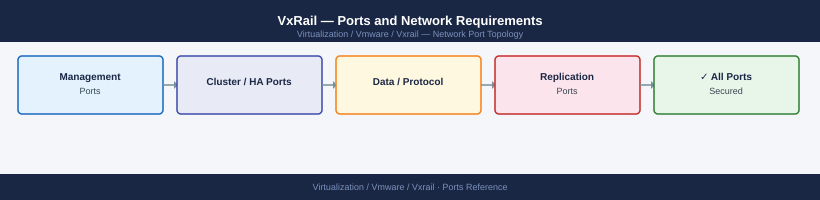

---
tags:
  - vxrail
  - networking
  - firewall
  - ports
  - dell
  - vsphere
---
# VxRail — Ports and Network Requirements

<div class="kb-summary">
Firewall port reference for Dell VxRail. VxRail runs the full vSphere stack, so all vCenter, ESXi, vSAN, and NSX port requirements also apply. This page covers VxRail-specific additions: VxRail Manager, iDRAC, LCM update paths, and RASR media access.

*Applies to: VxRail 7.x / 8.x*
</div>


## Before you begin

- VxRail requires all standard vSphere ports: see [vCenter](../../../vcenter/architecture/ports/), [ESXi](../../../esxi/architecture/ports/), [vSAN](../../../vsan/architecture/ports/), and [NSX](../../../nsx/architecture/ports/) port pages
- VxRail Manager VM must reach vCenter, all ESXi hosts, and Dell/Broadcom update servers
- iDRAC ports are required for hardware monitoring, firmware updates, and RASR recovery — open from the iDRAC VLAN to management systems

---

## VxRail Manager VM

The VxRail Manager runs as a VM (typically on the first node). It coordinates LCM, health checks, and cluster operations.

| Port | Protocol | Source | Destination | Purpose |
|---|---|---|---|---|
| 443 | TCP | Admin workstations, vCenter plugin | VxRail Manager VM IP | VxRail Manager UI and REST API |
| 22 | TCP | Jump hosts | VxRail Manager VM IP | SSH — VxRail Manager CLI (admin/mystic) |
| 443 | TCP | VxRail Manager | vCenter Server | VxRail Manager → vCenter API (cluster operations) |
| 443 | TCP | VxRail Manager | ESXi host management IPs | VxRail Manager → ESXi (health queries, firmware push) |
| 443 | TCP | VxRail Manager | *.dell.com, *.emc.com | LCM bundle downloads, entitlement checks |
| 443 | TCP | VxRail Manager | *.vmware.com, *.broadcom.com | vSphere and NSX update metadata |

---

## iDRAC (Integrated Dell Remote Access Controller)

Each VxRail node has an iDRAC for out-of-band management, hardware monitoring, and RASR virtual media.

| Port | Protocol | Source | Destination | Purpose |
|---|---|---|---|---|
| 443 | TCP | Admin workstations | iDRAC management IP | iDRAC web UI, REST API (Redfish) |
| 22 | TCP | Jump hosts | iDRAC management IP | iDRAC SSH CLI (racadm) |
| 623 | UDP | IPMI management tools | iDRAC management IP | IPMI/RMCP (hardware power, sensor polling) |
| 5900 | TCP | Admin workstations | iDRAC management IP | iDRAC Virtual Console (legacy VNC) |
| 5901 | TCP | Admin workstations | iDRAC management IP | iDRAC Virtual Console (alternate) |
| 443 | TCP | iDRAC management IP | *.dell.com | iDRAC firmware update check, Dell support call-home |
| 514 | UDP/TCP | iDRAC management IP | Syslog server | iDRAC syslog forwarding |
| 162 | UDP | iDRAC management IP | SNMP trap receiver | iDRAC SNMP traps (hardware alerts) |
| 161 | UDP | Monitoring system | iDRAC management IP | SNMP polling of hardware sensors |

---

## LCM and Update Access (Outbound)

| Port | Protocol | Destination | Purpose |
|---|---|---|---|
| 443 | TCP | downloads.dell.com | LCM firmware bundles, VxRail bundle downloads |
| 443 | TCP | api.dell.com | Dell warranty and entitlement checks |
| 443 | TCP | support.emc.com | ESRS (ConnectEMC) phone-home for support |
| 443 | TCP | *.vmware.com, *.broadcom.com | vSphere and NSX update metadata |

---

## RASR Recovery

When performing RASR (node re-image), access requirements:

| Port | Protocol | Source | Destination | Purpose |
|---|---|---|---|---|
| 443 | TCP | Admin workstation | iDRAC IP | iDRAC UI for virtual media mount (RASR ISO) |
| 5900 | TCP | Admin workstation | iDRAC IP | iDRAC Virtual Console (monitor RASR progress) |

See [VxRail — RASR](../../rasr/) for the full rebuild procedure.

---

## Firewall Zone Summary

| From | To | Ports | Notes |
|---|---|---|---|
| Admin clients | VxRail Manager VM | 443, 22 | VxRail management and LCM |
| Admin clients | iDRAC IPs | 443, 22, 623 UDP | Out-of-band hardware management |
| VxRail Manager | vCenter | 443 | Required for cluster operations |
| VxRail Manager | ESXi management IPs | 443 | Health queries and firmware staging |
| VxRail Manager | *.dell.com, *.broadcom.com | 443 | LCM bundle downloads (outbound) |
| iDRAC IPs | SNMP receiver | 162 UDP | Hardware alerts |
| iDRAC IPs | Syslog server | 514 UDP | Hardware event logging |

Also open all [vCenter ports](../../../vcenter/architecture/ports/), [ESXi ports](../../../esxi/architecture/ports/), [vSAN ports](../../../vsan/architecture/ports/), and [NSX ports](../../../nsx/architecture/ports/) as applicable to the deployment.

---

## Verify

```bash
# From admin workstation — test VxRail Manager API
curl -sk -o /dev/null -w "%{http_code}" https://<vxrail-manager-ip>/rest/vxm/v1/system

# From jump host — test iDRAC web access
curl -sk -o /dev/null -w "%{http_code}" https://<idrac-ip>/redfish/v1/

# From iDRAC SSH
racadm getsysinfo | head -20

# From VxRail Manager SSH — test vCenter connectivity
curl -sk -o /dev/null -w "%{http_code}" https://<vcenter-ip>/rest/com/vmware/cis/session

# Check LCM update server connectivity
curl -sk -o /dev/null -w "%{http_code}" https://downloads.dell.com
```

---

## See also

- [VxRail — Architecture](../how-it-works/)
- [VxRail — RASR](../../rasr/)
- [vCenter — Ports](../../vcenter/architecture/ports.md)
- [ESXi — Ports](../../esxi/architecture/ports.md)
- [vSAN — Ports](../../vsan/architecture/ports.md)
- [NSX — Ports](../../nsx/architecture/ports.md)
