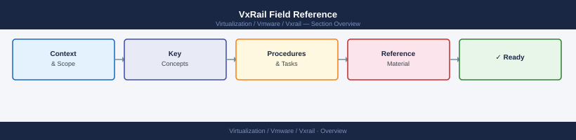

---
tags:
  - vxrail
---
# VxRail Field Reference

<div class="kb-summary">
VxRail Field Reference reference covering Overview, Daily Checks, Dependencies, Common Issues, Troubleshooting Workflow and 1 more sections.

*Applies to: VxRail 7.x · 8.x*
</div>



```d2
direction: right

center: "VxRail" {shape: hexagon}
daily_checks: "Daily Checks" {shape: rectangle}
dependencies: "Dependencies" {shape: rectangle}
common_issues: "Common Issues" {shape: rectangle}
troubleshooting_workflow: "Troubleshooting Workflow" {shape: rectangle}
best_practices: "Best Practices" {shape: rectangle}

center -> daily_checks
center -> dependencies
center -> common_issues
center -> troubleshooting_workflow
center -> best_practices
```

## Overview

Core operational reference for VxRail infrastructure.

## Daily Checks

| Check | Command | Notes |
|---|---|---|
| Review alerts |  |  |
| Confirm services healthy |  |  |
| Check capacity |  |  |
| Validate connectivity |  |  |
| Review recent changes |  |  |

## Dependencies

- DNS
- NTP
- Authentication
- Network connectivity
- Storage availability
- Monitoring
- Backup

## Common Issues

- Service failure
- Certificate expiration
- Capacity pressure
- Network issue
- Authentication issue

## Troubleshooting Workflow

1. Confirm scope
2. Review alerts
3. Check logs
4. Validate dependencies
5. Escalate with evidence

## Best Practices

| Recommendation | Detail |
|---|---|
| Keep versions aligned | Keep versions aligned |
| Maintain monitoring | Maintain monitoring |
| Validate changes | Validate changes |
| Document ownership | Document ownership |
