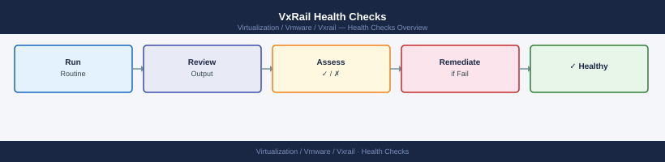

---
tags:
  - vxrail
---
# VxRail Health Checks

<div class="kb-summary">
VxRail Health Checks reference covering Overview, Where It Fits, Daily Checks, Health Commands, Common Issues and 3 more sections.

*Applies to: VxRail 7.x · 8.x*
</div>



```d2
direction: right

begin_checks: "Begin Checks" {shape: oval}
run_this_routine: "Run This Routine" {shape: rectangle}
where_it_fits: "Where It Fits" {shape: rectangle}
daily_checks: "Daily Checks" {shape: rectangle}
health_commands: "Health Commands" {shape: rectangle}
common_issues: "Common Issues" {shape: rectangle}
operational_tasks: "Operational Tasks" {shape: rectangle}
generate_report: "Generate Report" {shape: oval}

begin_checks -> run_this_routine
run_this_routine -> where_it_fits
where_it_fits -> daily_checks
daily_checks -> health_commands
health_commands -> common_issues
common_issues -> operational_tasks
operational_tasks -> generate_report
```

## Run This Routine

Run these steps in order for every daily check, pre-change validation, or post-incident review of the VxRail cluster.

1. **VxRail Manager cluster status** — Log in to VxRail Manager UI → Dashboard. Confirm cluster health indicator is green. Any non-green status requires investigation before proceeding with changes.
2. **vSAN health** — In vCenter, select the VxRail cluster → Monitor → vSAN → Health. All health checks must show green. Investigate and resolve any failing checks; common culprits are clock skew, capacity imbalance, and network connectivity failures.
3. **Node inventory status** — In VxRail Manager → Inventory → Nodes, confirm all nodes show status `Healthy`. A node in `Degraded` or `Unknown` state needs immediate triage — check iDRAC events and ESXi host logs.
4. **LCM compliance** — In VxRail Manager → Lifecycle Management, verify all nodes are listed as `Compliant` against the current baseline. Non-compliant nodes must be remediated before the next change window.
5. **iDRAC connectivity** — From the management host, ping each node's iDRAC IP (`ping <idrac-ip>`). All pings must succeed. An unreachable iDRAC means out-of-band management is unavailable for that node.
6. **NTP time synchronisation** — SSH to each ESXi host and run `esxcli system time get`. Compare timestamps across all hosts — skew must be less than 5 seconds. Time drift causes vSAN and vCenter authentication failures.
7. **vCenter connectivity** — In VxRail Manager → Settings → vCenter Server, confirm the connection status shows `Connected`. A disconnected vCenter stops all VxRail management operations.
8. **Open alerts review** — In VxRail Manager → Alerts, review all open alerts. Resolve or acknowledge any `Critical` or `Warning` alerts, assigning owner and due date for each unresolved item before closing the check.

## Overview

VxRail Health Checks notes for infrastructure operations, support, health checks, and troubleshooting.

## Where It Fits

Use this page for daily, pre-change, and post-change VxRail cluster validation.

## Daily Checks

| Check | Command | Notes |
|---|---|---|
| Review active alerts. |  |  |
| Confirm management access. |  |  |
| Check capacity, health, and recent task failures. |  |  |
| Review backup, replication, or protection status where applicable. |  |  |
| Confirm recent changes did not create new warnings. |  |  |

## Health Commands

```bash
# Add environment-specific commands here
```

## Common Issues

- Certificate or authentication problems.
- Capacity pressure.
- Failed or stuck tasks.
- Version mismatch after upgrades.
- Alert noise without clear ownership.
- Configuration drift from standards.

## Operational Tasks

| Task | Command |
|---|---|
| Check service health. |  |
| Review inventory and ownership. |  |
| Validate monitoring coverage. |  |
| Confirm backup or recovery posture. |  |
| Document changes after maintenance work. |  |

## Upgrade Notes

- Confirm compatibility before upgrade.
- Review release notes and known issues.
- Validate backups and rollback options.
- Confirm maintenance window.
- Run post-upgrade health checks.

## Best Practices

| Recommendation | Detail |
|---|---|
| Keep naming consistent. | Keep naming consistent. |
| Document ownership and support boundaries. | Document ownership and support boundaries. |
| Use least privilege access. | Use least privilege access. |
| Keep versions aligned. | Keep versions aligned. |
| Validate changes after implementation. | Validate changes after implementation. |

## See also

- [VxRail — Overview](../../)
