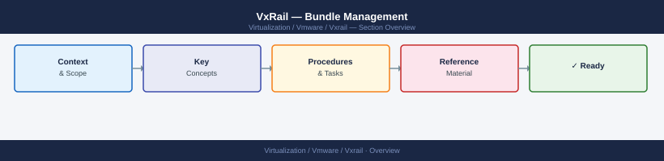

---
tags:
  - vxrail
---
# VxRail — Bundle Management



```text
                           │  upload via UI or SCP
```


```text
                           │  automatic
┌────────────────────────────────────────────────── ▼ ──────────────────────────────────────────────────┐
│  Validation                                                                                           │
│  checksum · version matrix · node compatibility                                                       │
│  PASS → bundle staged                                                                                 │
│  FAIL → error detail, do not proceed                                                                  │
└───────────────────────────────────────────────────────────────────────────────────────────────────────┘
                           │  on LCM start
```

```bash
# Add environment-specific commands here
```
