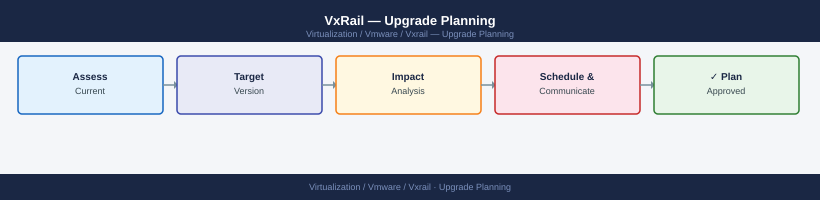

---
tags:
  - vxrail
---
# VxRail — Upgrade Planning



```bash

---

```d2
direction: right

plan: "Plan" {shape: oval}
phase_1_planning: "Phase 1: Planning" {shape: rectangle}
phase_2_preupgrade_health_checks: "Phase 2: Pre-Upgrade Health Checks" {shape: rectangle}
phase_3_preupgrade_support_bundle: "Phase 3: Pre-Upgrade Support Bundle" {shape: rectangle}
validate: "Validate" {shape: oval}

plan -> phase_1_planning
phase_1_planning -> phase_2_preupgrade_health_checks
phase_2_preupgrade_health_checks -> phase_3_preupgrade_support_bundle
phase_3_preupgrade_support_bundle -> validate
```

## Phase 1: Planning

### Capture Current State

Document:

- VxRail cluster name and version
- VxRail Manager version
- vCenter version
- ESXi version and vSAN version
- Node models and serial numbers
- Firmware bundle and driver versions
- Current alarms and open support cases

### Confirm Target Version

- Target VxRail version and upgrade path
- Internet-connected or offline upgrade method
- Expected upgrade duration
- Known issues for the target version
- Required Dell support engagement if any

### Review Release Notes

Check:

- Fixed and known issues
- Firmware and driver changes
- vCenter compatibility
- Required pre-checks
- Upgrade limitations

---

## Phase 2: Pre-Upgrade Health Checks

### VxRail Manager

- UI loads and communicates with vCenter
- Services healthy, certificate valid
- Enough disk space
- No failed prior upgrade tasks

### vCenter

- Login works, services healthy
- All hosts Connected, no unexpected maintenance mode
- HA and DRS healthy, no critical alarms

### vSAN Skyline Health

- Green — no failed disks, no inaccessible or degraded objects
- No unexpected resync, capacity within safe limits

### Hardware (Each Node)

- iDRAC reachable
- PSU, memory, CPU, fans, NICs, and disks healthy
- No predictive failures
- Firmware inventory available

### DNS, NTP, and Backup

- Forward and reverse DNS working for all nodes and vCenter
- NTP synchronized across all nodes
- vCenter backup completed
- Critical VM backups completed
- Backup team aware of maintenance

---

## Phase 3: Pre-Upgrade Support Bundle

Collect before starting:

- VxRail Manager support bundle
- vCenter, ESXi, vSAN, and iDRAC logs if issues exist

Save with standard name:

```

```text
vxrail-support-bundle-CLUSTERNAME-YYYY-MM-DD.zip
```
