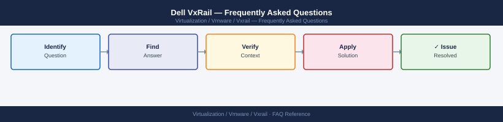

---
tags:
  - vxrail
  - faq
  - operations
---
# Dell VxRail — Frequently Asked Questions

*Applies to: Dell VxRail 7.x / 8.x*

Common questions about Dell VxRail operations, configuration, and troubleshooting. For step-by-step procedures, see the <a href="index.md">Operations</a> section.

## General

**Q: What VxRail software bundle version is recommended?**
A: VxRail 8.0.2xx or the latest validated bundle for your hardware generation. Check: VxRail Manager UI → Settings → Software → Installed Version. VxRail Manager also shows available upgrade packages.

**Q: How do I check the current Dell VxRail version?**
A: `VxRail Manager UI → Settings → Software → Installed Version`

## Configuration

**Q: What is the default VxRail vSAN storage policy?**
A: Default is FTT=1 RAID-1 (2-node mirror). For VxRail clusters with 5+ nodes, consider FTT=2 RAID-6 for better space efficiency. Storage policies are managed in vCenter — VxRail Manager uses the same vSAN policy framework.

**Q: How do I enable VxRail automated HCI System Software upgrades?**
A: VxRail Manager → LCM → Software Update. VxRail packages all component updates (vSphere, vSAN, VxRail Manager, Dell firmware) into a single validated bundle. Enable the update in VxRail Manager and it orchestrates the full rolling upgrade.

## Operations

**Q: How does VxRail LCM perform a rolling cluster upgrade?**
A: VxRail LCM puts one node into maintenance mode (migrating VMs via vMotion and vSAN data), applies the firmware and software bundle, reboots, waits for vSAN resync, then proceeds to the next node. Typically 30-60 minutes per node.

**Q: What is the correct procedure to add a new node to a VxRail cluster?**
A: Rack and cable the new node. Power on. In VxRail Manager → Cluster → Add Node. VxRail Manager discovers the node, validates hardware compatibility, and joins it to the cluster. Data rebalancing begins automatically.

## Troubleshooting

**Q: VxRail Manager shows 'Node health critical'. What does it mean?**
A: A hardware component (drive, NIC, PSU) in a node has failed or is degraded. VxRail Manager creates a SupportAssist case with Dell automatically for hardware issues. Log into iDRAC for the specific node to see the hardware error details.

**Q: VxRail VM performance is below expectations after adding workloads — where do I start?**
A: Check vSAN performance in vCenter → Cluster → Monitor → vSAN → Performance. Review vSAN cache hit ratio. Verify VxRail nodes have adequate CPU and memory headroom. Check that new workloads are not exceeding the vSAN all-flash write buffer.

## Backup and Recovery

**Q: How often should I back up VxRail configuration?**
A: VxRail Manager configuration is backed up as part of the vCenter backup (VxRail Manager runs as a VM). Additionally, export the VxRail appliance config from VxRail Manager → Settings → System → Export Configuration weekly.

**Q: Can I recover a failed VxRail node without losing data?**
A: If one node fails, vSAN reprotects data to remaining nodes (for FTT=1 clusters). Replace the failed node and VxRail Manager guides the replacement process (node must match hardware model). Data is rebuilt on the replacement node automatically.

## See Also

- [Dell VxRail Operations](index.md)
- [Dell VxRail Troubleshooting](../troubleshooting/index.md)
