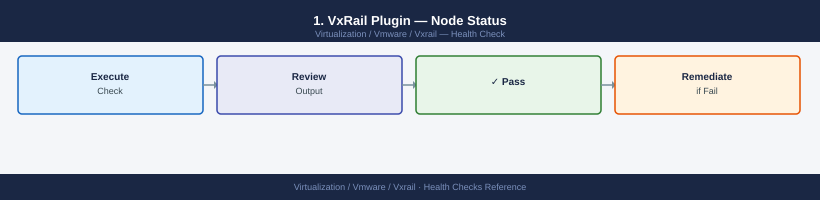
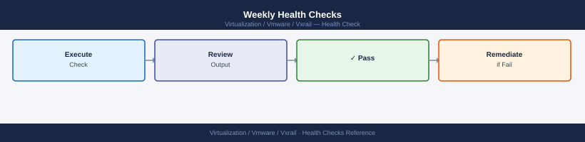
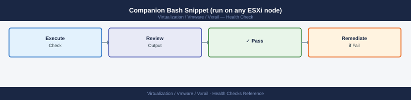

---
tags:
  - operations
  - vmware
  - vxrail
---
# VxRail — Health Checks

<div class="kb-summary">
Daily and weekly health check routine for VxRail clusters. Covers VxRail Plugin node status, vSAN object health and resync, iDRAC hardware alarms, capacity thresholds, and LCM bundle availability — with a single runnable sequence and alert threshold table.

*Applies to: VxRail 7.x / 8.x*
</div>


---

```d2
direction: right

hub: "VxRail\nOperations" {shape: hexagon}
alert_threshold_table: "Alert Threshold Table" {shape: rectangle}
daily_health_checks: "Daily Health Checks" {shape: rectangle}
weekly_health_checks: "Weekly Health Checks" {shape: rectangle}
run_this_routine: "Run This Routine" {shape: rectangle}
verify: "Verify" {shape: rectangle}

hub -> alert_threshold_table
hub -> daily_health_checks
hub -> weekly_health_checks
hub -> run_this_routine
hub -> verify
```

## Before you begin

- **Access:** vCenter read-only minimum; Administrator role for remediation steps
- **Timing:** safe to run during business hours unless a step is marked ⚠ (causes interruption)
- **Dependencies:** no active upgrades or migrations on the same infrastructure
- **Logging:** capture command output — paste into the change record on completion

---

## Alert Threshold Table


| Metric | Warning | Critical | Action |
|---|---|---|---|
| vSAN datastore used % | > 70% | > 80% | Add capacity or expand cluster |
| vSAN resync bytes (sustained > 1h) | > 0 bytes | Still growing | Investigate disk or node health |
| Online node count | < expected | < quorum | Investigate offline node immediately |
| iDRAC hardware faults | Warning severity | Critical severity | Open Dell support case |
| ESXi host disconnected from vCenter | Any disconnect | Stays disconnected > 5 min | Check management network and iDRAC |
| vSAN health checks failing | 1–2 non-critical | Any critical | Run full vSAN health; check disk groups |
| vCenter CPU/memory | > 80% | > 90% | Review VM placement and vCenter sizing |
| VxRail Manager VM availability | Degraded | Unreachable | Restore from backup; check cluster |

---

## Daily Health Checks


### 1. VxRail Plugin — Node Status



Open vCenter and navigate to: **Menu → VxRail → Cluster → Summary**

Check:

- All nodes show status **Online** (green)
- No nodes in **Error**, **Degraded**, or **Offline** state
- No active cluster alarms on the VxRail cluster object
- SupportAssist connectivity status is **Connected**

```bash
# API check — all hosts healthy
curl -sk \
  -H "Authorization: Basic $(echo -n 'mystic:password' | base64)" \
  "https://<vxm-ip>/rest/vxm/v1/hosts" | \
  python3 -c "
import sys, json
hosts = json.load(sys.stdin)
for h in hosts:
    print(h.get('esxi_hostname','?'), '-', h.get('health','?'))
"
```

### 2. vSAN Health


SSH to any ESXi node in the cluster:

```bash
# Cluster-level health (all checks pass = OK)
esxcli vsan health cluster get

# Detailed summary — look for any WARNING or ERROR
esxcli vsan health summary get

# Object resync — must be 0 Remaining Bytes for normal operation
esxcli vsan debug resync list

# Network test — all nodes should reach all nodes
esxcli vsan debug network test
```

In PowerCLI:

```powershell
# vSAN health summary from vCenter
Get-VsanClusterHealthSummary -Cluster "VxRail-Cluster" |
  Select-Object OverallHealth, OverallHealthDescription
```

### 3. iDRAC Hardware Health


Check each node's iDRAC for hardware alarms. SSH to each node's iDRAC IP:

```bash
# Get system info — look for any Status: Warning or Critical
racadm getsysinfo

# Last 20 system event log entries — look for new faults
racadm getsel | tail -20
```

In OMIVV (vCenter plugin): **Menu → OpenManage Integration → Hardware → Alarms** — verify no red or orange alerts.

### 4. vSAN Capacity


```powershell
# Check vSAN datastore usage
Get-Datastore "vsanDatastore" | Select-Object Name,
    @{N="TotalGB"; E={[Math]::Round($_.CapacityGB)}},
    @{N="FreeGB"; E={[Math]::Round($_.FreeSpaceGB)}},
    @{N="UsedPct"; E={[Math]::Round((1 - $_.FreeSpaceGB/$_.CapacityGB)*100,1)}}
```

Alert if `UsedPct` exceeds **70%**. vSAN performance degrades above 70% as rebalancing becomes more frequent and slack capacity for rebuilds shrinks.

### 5. LCM Bundle Status


In vCenter: **VxRail Plugin → Lifecycle Management → Available Upgrades**

Or via API:

```bash
# Check if an upgrade bundle is available
curl -sk \
  -H "Authorization: Basic $(echo -n 'mystic:password' | base64)" \
  "https://<vxm-ip>/rest/vxm/v1/lcm/upgrade" | python3 -m json.tool
```

If a bundle is available, record it and plan an upgrade in the next maintenance window.

---

## Weekly Health Checks



### ESXi Version Consistency


All nodes in a VxRail cluster must run the same ESXi version and build. After any LCM upgrade, confirm consistency:

```powershell
# All hosts should show identical Version and Build
Get-VMHost | Select-Object Name,
    @{N="Version"; E={$_.Version}},
    @{N="Build"; E={$_.Build}} |
  Sort-Object Name | Format-Table -AutoSize
```

A mismatch means a node was skipped during LCM or a node was manually patched (not supported). Open a Dell support case if mismatch is unexplained.

### vSAN Storage Policy Compliance


```powershell
# Check all VMs for policy compliance — flag any non-compliant
Get-VM | Get-SpbmEntityConfiguration |
  Select-Object Entity, StoragePolicy, ComplianceStatus |
  Where-Object {$_.ComplianceStatus -ne "compliant"} |
  Format-Table -AutoSize
```

### Node Hardware Summary


```bash
# Run on each node — check BIOS and iDRAC firmware versions
racadm getversion -f bios
racadm getversion -f idrac

# Temperature and fan health
esxcli hardware sensor list --type Temperature | grep -i critical
esxcli hardware sensor list --type Fan | grep -i critical
```

---

## Run This Routine

Paste this sequence into a PowerCLI session connected to vCenter. It runs all critical daily checks in order and outputs a pass/fail summary.

```powershell
# === VxRail Daily Health Check Routine ===
# Prerequisites: Connect-VIServer first
# Also requires: curl access to VxRail Manager IP

$ClusterName  = "VxRail-Cluster"
$VxmIp        = "<vxm-ip>"
$VxmPassword  = "<mystic-password>"
$VsanDS       = "vsanDatastore"
$CapacityAlert = 70   # percent

$Auth = [Convert]::ToBase64String([Text.Encoding]::ASCII.GetBytes("mystic:$VxmPassword"))
$Headers = @{ Authorization = "Basic $Auth" }

Write-Host "`n=== VxRail Health Check: $(Get-Date -Format 'yyyy-MM-dd HH:mm') ===" -ForegroundColor Cyan

# 1. VxRail Plugin node status via API
Write-Host "`n[1] VxRail Node Status" -ForegroundColor Yellow
try {
    $hosts = Invoke-RestMethod -Uri "https://$VxmIp/rest/vxm/v1/hosts" `
        -Headers $Headers -SkipCertificateCheck
    foreach ($h in $hosts) {
        $status = $h.health
        $color  = if ($status -eq "NORMAL") { "Green" } else { "Red" }
        Write-Host "  $($h.esxi_hostname) — $status" -ForegroundColor $color
    }
} catch {
    Write-Host "  ERROR: Cannot reach VxRail Manager at $VxmIp" -ForegroundColor Red
}

# 2. vSAN cluster health
Write-Host "`n[2] vSAN Cluster Health" -ForegroundColor Yellow
$vsan = Get-VsanClusterHealthSummary -Cluster $ClusterName -ErrorAction SilentlyContinue
if ($vsan) {
    $color = if ($vsan.OverallHealth -eq "green") { "Green" } else { "Red" }
    Write-Host "  Overall Health: $($vsan.OverallHealth)" -ForegroundColor $color
} else {
    Write-Host "  ERROR: Cannot get vSAN health" -ForegroundColor Red
}

# 3. vSAN capacity
Write-Host "`n[3] vSAN Capacity" -ForegroundColor Yellow
$ds = Get-Datastore $VsanDS -ErrorAction SilentlyContinue
if ($ds) {
    $usedPct = [Math]::Round((1 - $ds.FreeSpaceGB / $ds.CapacityGB) * 100, 1)
    $color   = if ($usedPct -ge $CapacityAlert) { "Red" } else { "Green" }
    Write-Host "  $VsanDS — Used: $usedPct% (Total: $([Math]::Round($ds.CapacityGB)) GB, Free: $([Math]::Round($ds.FreeSpaceGB)) GB)" -ForegroundColor $color
} else {
    Write-Host "  ERROR: Datastore '$VsanDS' not found" -ForegroundColor Red
}

# 4. Host version consistency
Write-Host "`n[4] ESXi Version Consistency" -ForegroundColor Yellow
$hosts = Get-VMHost | Sort-Object Name
$versions = $hosts | Select-Object -ExpandProperty Version | Sort-Object -Unique
$builds   = $hosts | Select-Object -ExpandProperty Build   | Sort-Object -Unique
if ($versions.Count -eq 1 -and $builds.Count -eq 1) {
    Write-Host "  All nodes: ESXi $($versions[0]) build $($builds[0])" -ForegroundColor Green
} else {
    Write-Host "  VERSION MISMATCH DETECTED:" -ForegroundColor Red
    $hosts | Select-Object Name, Version, Build | Format-Table -AutoSize
}

# 5. vCenter alarms
Write-Host "`n[5] Active vCenter Alarms on Cluster" -ForegroundColor Yellow
$cluster = Get-Cluster $ClusterName
$alarms  = $cluster.ExtensionData.TriggeredAlarmState
if ($alarms.Count -eq 0) {
    Write-Host "  No active alarms" -ForegroundColor Green
} else {
    Write-Host "  $($alarms.Count) alarm(s) active — check vCenter alarms panel" -ForegroundColor Red
}

# 6. LCM upgrade availability
Write-Host "`n[6] LCM Upgrade Availability" -ForegroundColor Yellow
try {
    $lcm = Invoke-RestMethod -Uri "https://$VxmIp/rest/vxm/v1/lcm/upgrade" `
        -Headers $Headers -SkipCertificateCheck
    if ($lcm.state -and $lcm.state -ne "NONE") {
        Write-Host "  LCM job in state: $($lcm.state)" -ForegroundColor Yellow
    } else {
        Write-Host "  No active LCM job" -ForegroundColor Green
    }
} catch {
    Write-Host "  INFO: LCM endpoint returned no active job (expected when idle)" -ForegroundColor Gray
}

Write-Host "`n=== Health Check Complete ===" -ForegroundColor Cyan
```

### Companion Bash Snippet (run on any ESXi node)



```bash
#!/bin/bash
# Run on any VxRail ESXi node over SSH
# Checks vSAN health, resync, and network

echo "=== vSAN Health ==="
esxcli vsan health cluster get 2>&1 | grep -E "Health|Status|Error"

echo ""
echo "=== vSAN Resync ==="
esxcli vsan debug resync list 2>&1 | grep -E "Total|Remaining|Object"

echo ""
echo "=== vSAN Network Test ==="
esxcli vsan debug network test 2>&1 | tail -5

echo ""
echo "=== Hardware Sensors (Critical only) ==="
esxcli hardware sensor list 2>&1 | grep -i "critical" || echo "No critical sensors"
```

---

## See also

- [VxRail — Common Issues](../troubleshooting/common-issues/)
- [VxRail — Procedures](procedures/)
- [VxRail — CLI Reference](cli-reference/)

## Verify

- **Alarms:** vSphere Client → Home → Alarms — no new critical alarms after the operation
- **Events:** monitor the vCenter Events view for the affected object for 5 minutes
- **Health check:** run the morning health-check sequence for the affected product tier
