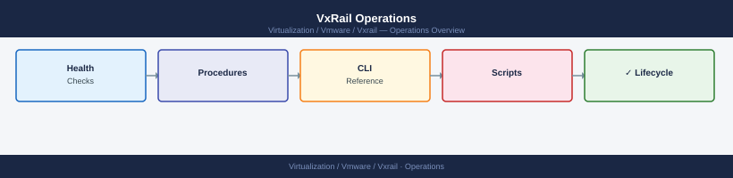

---
tags:
  - operations
  - vxrail
---
# VxRail Operations

VxRail operations notes for daily checks, maintenance windows, node work, expansion, support cases, and post-change validation.

*Applies to: VxRail 7.x / 8.x*

<a class="kb-card" href="daily-checks/">
  <strong>Daily Checks</strong>
  Daily VxRail cluster checks across VxRail Manager, vCenter, ESXi, vSAN, and hardware.
</a>

<a class="kb-card" href="maintenance-window/">
  <strong>Maintenance Window</strong>
  Preparation, execution, validation, and communication during VxRail maintenance.
</a>

<a class="kb-card" href="node-maintenance/">
  <strong>Node Maintenance</strong>
  Node-level maintenance planning, evacuation, validation, and return to service.
</a>

<a class="kb-card" href="cluster-expansion/">
  <strong>Cluster Expansion</strong>
  Node add planning, compatibility, network checks, and validation.
</a>

<a class="kb-card" href="support-case-prep/">
  <strong>Support Case Prep</strong>
  Evidence, timeline, logs, screenshots, and clear issue summary for Dell support.
</a>

<a class="kb-card" href="post-change-validation/">
  <strong>Post-Change Validation</strong>
  Validation after lifecycle, hardware, configuration, or support changes.
</a>

<a class="kb-card" href="lcm-failure-triage/">
  <strong>LCM Failure Triage</strong>
  Diagnose stuck or failed VxRail LCM upgrades — bundle validation, component errors, and remediation steps.
</a>

<a class="kb-card" href="node-health-review/">
  <strong>Node Health Review</strong>
  Per-node health review covering hardware alerts, disk groups, network state, and iDRAC status.
</a>

<a class="kb-card" href="pre-upgrade-checks/">
  <strong>Pre-Upgrade Checks</strong>
  Pre-upgrade readiness checks for VxRail — compatibility, cluster health, free capacity, and snapshot state.
</a>

