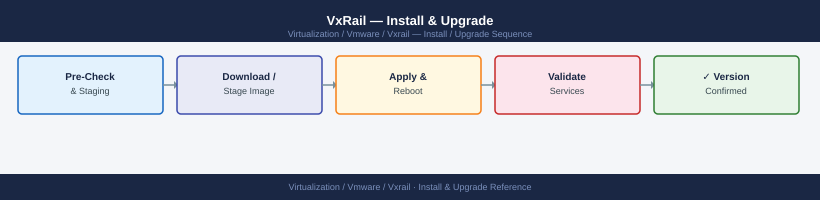

---
tags:
  - operations
  - vmware
  - vxrail
---
# VxRail — Install & Upgrade

<div class="kb-summary">
VxRail LCM upgrade workflow from bundle download through post-upgrade validation. Covers obtaining and uploading the bundle, running pre-upgrade checks, the node-by-node upgrade sequence, monitoring progress, and a common LCM failure reference table.

*Applies to: VxRail 7.x / 8.x*
</div>



---

```d2
direction: right

hub: "VxRail\nOperations" {shape: hexagon}
lcm_preupgrade_checklist: "LCM Pre-Upgrade Checklist" {shape: rectangle}
step_1_obtain_the_upgrade_bundle: "Step 1 — Obtain the Upgrade Bundle" {shape: rectangle}
step_2_upload_the_bundle: "Step 2 — Upload the Bundle" {shape: rectangle}
step_3_run_preupgrade_checks: "Step 3 — Run Pre-Upgrade Checks" {shape: rectangle}
step_4_run_the_upgrade: "Step 4 — Run the Upgrade" {shape: rectangle}
step_5_monitor_progress: "Step 5 — Monitor Progress" {shape: rectangle}

hub -> lcm_preupgrade_checklist
hub -> step_1_obtain_the_upgrade_bundle
hub -> step_2_upload_the_bundle
hub -> step_3_run_preupgrade_checks
hub -> step_4_run_the_upgrade
hub -> step_5_monitor_progress
```

## Before you begin

- **Access:** vCenter read-only minimum; Administrator role for remediation steps
- **Timing:** safe to run during business hours unless a step is marked ⚠ (causes interruption)
- **Dependencies:** no active upgrades or migrations on the same infrastructure
- **Logging:** capture command output — paste into the change record on completion

---

!!! warning "Host enters maintenance mode"
    ESXi remediation puts hosts into maintenance mode, triggering DRS evacuation. Confirm DRS is Fully Automated and HA admission control is satisfied before starting.

## LCM Pre-Upgrade Checklist

Complete this checklist before initiating any VxRail LCM upgrade. LCM will run its own pre-check, but these manual verifications catch issues that may not surface in the automated check.

- [ ] vSAN health is all green — `esxcli vsan health cluster get`
- [ ] vSAN resync bytes = 0 — `esxcli vsan debug resync list`
- [ ] All VxRail nodes Online in VxRail Plugin
- [ ] vCenter and VxRail Manager are reachable and not reporting alarms
- [ ] Change window approved; storage and application teams notified
- [ ] VxRail Manager VM backup taken (Veeam or equivalent — not just a snapshot)
- [ ] VxRail Manager VM snapshot taken immediately before upgrade (temporary safety net — remove within 24h)
- [ ] vCenter file-based backup current (VAMI: `https://<vcenter>:5480`)
- [ ] Target bundle compatibility confirmed against Dell VxRail Software Compatibility Matrix
- [ ] DRS is configured to **Fully Automated** — VMs must migrate automatically during node maintenance
- [ ] Sufficient cluster capacity to run all VMs on N-1 nodes during upgrade

---

## Step 1 — Obtain the Upgrade Bundle

Download the VxRail Upgrade Bundle from Dell's support portal:

```text
https://www.dell.com/support
→ Product Support
→ Search for your VxRail serial or model
→ Drivers & Downloads
→ Filter: VxRail Manager Upgrade Bundle
```

The bundle is a single signed `.bin` file, typically 5–20 GB depending on the target version. Verify the SHA256 checksum after download:

```bash
# Verify bundle integrity (Linux/macOS)
sha256sum VxRail-7.0.401-bundle.bin

# Windows PowerShell
Get-FileHash -Algorithm SHA256 VxRail-7.0.401-bundle.bin
```

Compare the hash against the value shown on the Dell support page.

---

## Step 2 — Upload the Bundle

**Option A: VxRail Plugin (recommended for interactive uploads)**

In vCenter: **VxRail Plugin → Lifecycle Management → Upload Bundle → Browse**

Select the `.bin` file. Upload time depends on storage and network — allow 15–60 minutes for large bundles.

**Option B: VxRail Manager API (for automation or CLI preference)**

```bash
# Upload via multipart POST to VxRail Manager
curl -sk \
  -H "Authorization: Basic $(echo -n 'mystic:password' | base64)" \
  -F "file=@/tmp/VxRail-7.0.401-bundle.bin" \
  "https://<vxm-ip>/rest/vxm/v1/lcm/bundle"
```

**Verify the bundle is listed after upload:**

```bash
curl -sk \
  -H "Authorization: Basic $(echo -n 'mystic:password' | base64)" \
  "https://<vxm-ip>/rest/vxm/v1/lcm/upgrade" | python3 -m json.tool
```

---

## Step 3 — Run Pre-Upgrade Checks

**VxRail Plugin: Lifecycle Management → Pre-Check → Run Pre-Check**

The pre-check validates:

- Cluster health is green (all nodes reachable)
- No active vSAN resync
- Bundle version is compatible with the current cluster version
- vCenter credentials stored in VxRail Manager are valid
- All nodes are at the expected current version (no partial upgrades)
- Sufficient disk space on VxRail Manager for the upgrade process

```bash
# Check pre-check results via API
curl -sk \
  -H "Authorization: Basic $(echo -n 'mystic:password' | base64)" \
  "https://<vxm-ip>/rest/vxm/v1/lcm/precheck/status" | python3 -m json.tool
```

**Do not proceed if any pre-check item shows FAILED.** Resolve the listed issue and re-run the pre-check.

---

## Step 4 — Run the Upgrade

**VxRail Plugin: Lifecycle Management → Upgrade → Start Upgrade**

Confirm the target bundle version and click **Start**.

The LCM upgrades the cluster node by node:

1. **Node enters maintenance mode** — DRS migrates all VMs to other nodes; vSAN evacuates data objects
2. **ESXi and firmware updates applied** — BIOS, iDRAC, NIC, HBA, and disk controller firmware updated first, then ESXi patched
3. **Node reboots** — may reboot multiple times if multiple firmware updates are staged
4. **Node exits maintenance mode** — rejoins the vSphere cluster
5. **vSAN resyncs** — LCM waits until vSAN resync bytes = 0 before moving to the next node

After all nodes are done, VxRail Manager and vCenter Server are upgraded (order may vary by bundle version).

**Estimated duration:** 30–120 minutes per node. A 4-node cluster typically takes 3–6 hours total.

---

## Step 5 — Monitor Progress

**VxRail Plugin: Lifecycle Management → Upgrade Status**

Or poll via API:

```bash
# Poll LCM upgrade job status (run repeatedly)
curl -sk \
  -H "Authorization: Basic $(echo -n 'mystic:password' | base64)" \
  "https://<vxm-ip>/rest/vxm/v1/lcm/upgrade" | python3 -m json.tool
```

Key fields in the API response:

| Field | Meaning |
|---|---|
| `state` | `IN_PROGRESS`, `COMPLETED`, `FAILED`, `PAUSED` |
| `percent_complete` | Overall progress percentage |
| `current_host` | Node currently being upgraded |
| `error_message` | Set if state is FAILED |

During upgrade, also watch:

- vCenter Tasks panel for maintenance mode events
- vSAN resync: `esxcli vsan debug resync list` from any remaining node

---

## Step 6 — Post-Upgrade Validation

Run these checks as soon as the LCM job reports COMPLETED:

```powershell
# Verify all nodes are at the expected ESXi version and build
Get-VMHost | Select-Object Name,
    @{N="Version"; E={$_.Version}},
    @{N="Build"; E={$_.Build}} |
  Sort-Object Name | Format-Table -AutoSize

# Verify vSAN health is green
Get-VsanClusterHealthSummary -Cluster "VxRail-Cluster" |
  Select-Object OverallHealth, OverallHealthDescription

# Check for any policy compliance issues post-upgrade
Get-VM | Get-SpbmEntityConfiguration |
  Select-Object Entity, StoragePolicy, ComplianceStatus |
  Where-Object {$_.ComplianceStatus -ne "compliant"} |
  Format-Table -AutoSize
```

```bash
# Verify VxRail Manager version via API
curl -sk \
  -H "Authorization: Basic $(echo -n 'mystic:password' | base64)" \
  "https://<vxm-ip>/rest/vxm/v1/system" | python3 -c "
import sys, json
d = json.load(sys.stdin)
print('VxRail Version:', d.get('version','?'))
print('Build Number:  ', d.get('build_number','?'))
"

# Check iDRAC firmware version on each node
racadm getversion -f idrac
racadm getversion -f bios
```

Post-upgrade checklist:

- [ ] All nodes Online in VxRail Plugin
- [ ] vSAN health all green, resync = 0
- [ ] ESXi version matches the target bundle version (consistent across all nodes)
- [ ] VxRail Manager version matches the target bundle version
- [ ] No new vCenter alarms
- [ ] VMs running normally and accessible
- [ ] iDRAC FW version matches expected (verify against bundle release notes)
- [ ] Pre-LCM snapshot of VxRail Manager VM **deleted** (snapshots degrade vSAN performance)

---

## Common LCM Failure Table

| Failure | Cause | Resolution |
|---|---|---|
| Pre-check fails: vSAN health not green | vSAN disk or network issue | Fix vSAN health errors before retrying; check disk groups and network connectivity |
| Pre-check fails: resync bytes > 0 | vSAN rebuilding or rebalancing | Wait for resync to complete; do not force upgrade while resync is active |
| Pre-check fails: node unreachable | Node offline or management network issue | Bring node online; check iDRAC and management network connectivity |
| Pre-check fails: credential invalid | vCenter credentials in VxRail Manager are stale | Update vCenter credentials in VxRail Manager settings |
| Pre-check fails: bundle incompatible | Attempting a multi-hop upgrade (skipping versions) | Check Dell upgrade path requirements; may need intermediate upgrade first |
| Upload fails: insufficient disk space | VxRail Manager VM disk is full | Expand the VxRail Manager VM disk or remove old bundle files |
| Upgrade stuck: node in maintenance mode | vSAN evacuation taking too long (large data set) | Wait; if stuck > 4h check vSAN for degraded objects that can't evacuate |
| Upgrade fails mid-node: ESXi patch fails | Incompatible or corrupt bundle; disk failure | Check VxRail Manager logs; contact Dell support with support bundle |
| Upgrade fails: vCenter update fails | vCenter unreachable or disk full during update | Check vCenter VAMI; ensure vCenter has sufficient disk space |
| Post-upgrade: version mismatch on one node | Node was offline during upgrade | Re-run LCM upgrade — it will apply to the skipped node only |
| Post-upgrade: vSAN health warning persists | Rebuild in progress or clock skew | Wait for rebuild; check NTP on all nodes if warning is clock-related |

---

## See also

- [VxRail — Health Checks](health-checks/)
- [VxRail — Common Issues](../troubleshooting/common-issues/)
- [VxRail — Procedures](procedures/)

## Verify

- **Alarms:** vSphere Client → Home → Alarms — no new critical alarms after the operation
- **Events:** monitor the vCenter Events view for the affected object for 5 minutes
- **Health check:** run the morning health-check sequence for the affected product tier
