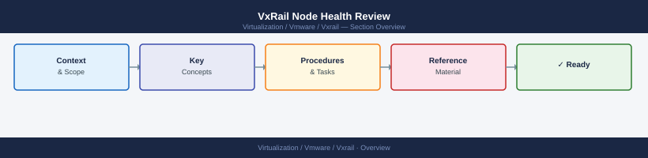

---
tags:
  - operations
  - vxrail
---
# VxRail Node Health Review

VxRail Node Health Review reference covering Overview, Pre-Checks, Steps, Validation, Rollback and 1 more sections.

*Applies to: VxRail 7.x / 8.x*

## Before you begin

- **Access:** vCenter read-only minimum; Administrator role for remediation steps
- **Timing:** safe to run during business hours unless a step is marked ⚠ (causes interruption)
- **Dependencies:** no active upgrades or migrations on the same infrastructure
- **Logging:** capture command output — paste into the change record on completion

---

## Overview

Use this page to review host, hardware, vSAN, and cluster health by node.

## Pre-Checks

- Confirm scope.
- Confirm maintenance window if changes are planned.
- Confirm current health.
- Check recent alerts and tasks.
- Confirm access to management tools.
- Confirm rollback path if configuration changes are made.

## Steps

1. Identify the affected object.
2. Capture current state.
3. Review alarms, logs, and recent changes.
4. Apply the planned action.
5. Validate service health.
6. Record notes and follow-up items.

## Validation

- Confirm the object is healthy.
- Confirm no new critical alarms.
- Confirm monitoring reflects the expected state.
- Confirm related systems still have access.
- Document the result.

## Rollback

- Revert the changed setting if possible.
- Restore prior configuration from documented state.
- Escalate if rollback requires vendor support.

## Notes

Keep screenshots, task IDs, error messages, and timestamps with the change or incident record.

---

## Verify

- VxRail Manager shows all nodes in `Healthy` state with no active alerts
- Disk health in VxRail Manager → Hardware → Disks shows all drives `Online`
- vSAN health check returns no errors for the reviewed node
- iDRAC hardware summary shows no amber/red indicators on reviewed host

## See also

- [VxRail — Backup & Restore](backup-restore.md)
- [VxRail — CLI Reference](cli-reference.md)
- [VxRail Cluster Expansion](cluster-expansion.md)
- [VxRail Operations](index.md)
- [VxRail — Architecture](../architecture/)
- [VxRail — Deploy](../deploy/)
- [VxRail Security](../security/)
- [VxRail Troubleshooting](../troubleshooting/)
