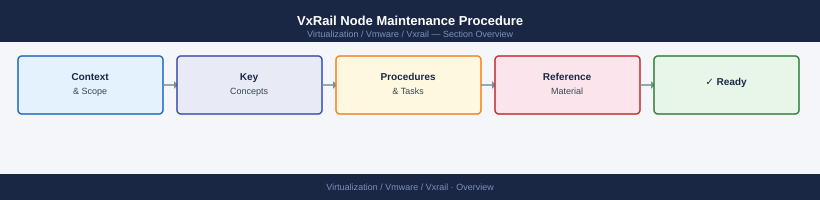

---
tags:
  - operations
  - vxrail
---
# VxRail Node Maintenance Procedure


<div class="kb-summary">
VxRail Node Maintenance Procedure reference covering Before Starting, Evacuation Mode Selection, Entering Maintenance Mode, Performing the Work, Exiting Maintenance Mode and 1 more sections.

*Applies to: VxRail 7.x / 8.x*
</div>



Node Maintenance Mode Lifecycle


```d2
direction: right

hub: "VxRail\nOperations" {shape: hexagon}
before_starting: "Before Starting" {shape: rectangle}
evacuation_mode_selection: "Evacuation Mode Selection" {shape: rectangle}
entering_maintenance_mode: "Entering Maintenance Mode" {shape: rectangle}
performing_the_work: "Performing the Work" {shape: rectangle}
exiting_maintenance_mode: "Exiting Maintenance Mode" {shape: rectangle}
postmaintenance_validation: "Post-Maintenance Validation" {shape: rectangle}

hub -> before_starting
hub -> evacuation_mode_selection
hub -> entering_maintenance_mode
hub -> performing_the_work
hub -> exiting_maintenance_mode
hub -> postmaintenance_validation
```

## Before you begin

- **Access:** vCenter read-only minimum; Administrator role for remediation steps
- **Timing:** safe to run during business hours unless a step is marked ⚠ (causes interruption)
- **Dependencies:** no active upgrades or migrations on the same infrastructure
- **Logging:** capture command output — paste into the change record on completion

---

## Before Starting

- Confirm cluster health in vCenter — no critical alarms
- Confirm vSAN Skyline Health is green
- Confirm no active vSAN resyncs (or they are at an acceptable level)
- Confirm cluster has capacity to absorb the workload from this node

## Evacuation Mode Selection

When entering maintenance mode on a VxRail node:

| Option | When to Use |
|---|---|
| Ensure Accessibility | Standard maintenance — keeps data accessible without full migration |
| Full Data Migration | Before disk replacement or extended maintenance |
| No Data Migration | Only with Dell support guidance |

## Entering Maintenance Mode

1. In vCenter, right-click the VxRail node → **Maintenance Mode** → **Enter Maintenance Mode**
2. Select the appropriate evacuation mode
3. Monitor vSAN resync if full migration is selected
4. Wait for maintenance mode to complete before starting hardware or firmware work

## Performing the Work

- Complete only the approved scope of work
- Do not extend beyond the maintenance window without notification
- Confirm iDRAC access throughout the maintenance if hardware is involved

## Exiting Maintenance Mode

1. Right-click the host → **Maintenance Mode** → **Exit Maintenance Mode**
2. Confirm host reconnects to vCenter
3. Monitor vSAN rebalancing — this is expected and may take time
4. Confirm vSAN object health is green after rebalancing completes

## Post-Maintenance Validation

- Host is Connected in vCenter
- No new critical alerts
- vSAN Skyline Health is green
- VxRail Manager shows the node as healthy
- Firmware matches the approved cluster baseline

---

## Verify

- Confirm the operation completed without errors in the log or management UI
- Verify the expected state change is visible (service running, object created, config applied)
- Document the outcome in the change record

## See also

- [VxRail — Backup & Restore](backup-restore.md)
- [VxRail — CLI Reference](cli-reference.md)
- [VxRail Cluster Expansion](cluster-expansion.md)
- [VxRail Operations](index.md)
- [VxRail — Architecture](../architecture/)
- [VxRail — Deploy](../deploy/)
- [VxRail Security](../security/)
- [VxRail Troubleshooting](../troubleshooting/)
