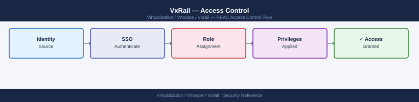

---
tags:
  - security
  - vmware
  - vxrail
---
# VxRail — Access Control

<div class="kb-summary">
RBAC and access scoping for VxRail in the VMware product context. Covers VxRail Manager roles, vSphere RBAC, lockdown mode, exception users, OMIVV permissions, and network access restrictions.

*Applies to: VxRail 7.x / 8.x*
</div>


---

## Before you begin

- **Access:** vCenter Administrator role
- **Change management:** security changes require CAB approval in most environments
- **Rollback plan:** document current state before any security control change
- **Testing:** validate in a non-production environment first where possible

---

## VxRail Manager Roles

VxRail Manager has two built-in access levels. When LDAP is not configured, only the local `mystic` account with Admin access exists.

| Role | Access scope | Notes |
|---|---|---|
| Admin (`mystic` or LDAP-mapped) | Full VxRail Manager access: LCM, cluster config, support upload, health | Required for all LCM operations. Assign to `GRP-VxRail-Admins` AD group |
| Read-only (LDAP-mapped only) | View cluster health, node status, LCM status — no changes | Assign to monitoring teams and `GRP-VxRail-ReadOnly` AD group |

LDAP group-based role assignment is configured in **VxRail Plugin → Settings → LDAP Configuration → Role Mapping**. Refer to the [Authentication](authentication/) page for LDAP setup steps.

---

## vSphere RBAC for VxRail Operations

Define discrete vCenter roles for VxRail-specific operational tasks. Assign roles at the narrowest scope that allows the team to do their work.

| Team | vCenter Role | Scope | Rationale |
|---|---|---|---|
| VxRail Administrators | Administrator | VxRail Cluster object | Full control of VxRail cluster; scoped to prevent Datacenter-wide changes |
| Storage Operations | Custom (vSAN ops) | Cluster level | vSAN health, capacity, and encryption management only |
| Application / VM Owners | VM Operator (custom) | VM Folder or Resource Pool | VM power, snapshot, and console; no host or network access |
| Read-only / Monitoring | Read-only | Datacenter | View all objects; monitoring and alerting tools |

### Custom Role: Storage Operations

Create a custom vCenter role for storage administrators who manage vSAN but should not control VMs or hosts:

```powershell
# Create custom Storage Operations role in vCenter (PowerCLI)
$storagePrivileges = @(
    "StorageProfile.Update",
    "StorageProfile.View",
    "Datastore.Browse",
    "Datastore.AllocateSpace",
    "Datastore.Config",
    "Datastore.Move",
    "Host.Config.Storage",
    "Global.CancelTask"
)
New-VIRole -Name "VxRail-Storage-Ops" -Privilege (Get-VIPrivilege -Id $storagePrivileges)
```

### Custom Role: VM Operator

Create a VM Operator role scoped to application team resource pools:

```powershell
# Create custom VM Operator role (PowerCLI)
$vmPrivileges = @(
    "VirtualMachine.Interact.PowerOn",
    "VirtualMachine.Interact.PowerOff",
    "VirtualMachine.Interact.Reset",
    "VirtualMachine.Interact.ConsoleInteract",
    "VirtualMachine.State.CreateSnapshot",
    "VirtualMachine.State.RemoveSnapshot",
    "VirtualMachine.State.RevertToSnapshot",
    "VirtualMachine.GuestOperations.Execute",
    "Resource.AssignVMToPool"
)
New-VIRole -Name "VxRail-VM-Operator" -Privilege (Get-VIPrivilege -Id $vmPrivileges)
```

Assign the `VxRail-VM-Operator` role to AD groups scoped to their resource pool or VM folder — not to the cluster or datacenter level.

---

## Lockdown Mode

### Normal vs Strict

ESXi lockdown mode prevents direct host access and forces all management through vCenter. VxRail requires **Normal Lockdown** — not Strict.

| Mode | DCUI | SSH | vCenter API path | VxRail Manager impact |
|---|---|---|---|---|
| Disabled | Available | Available | Available | No restriction — do not use in production |
| Normal | Available to exception users | Disabled | Available | VxRail Manager LCM operations work correctly |
| Strict | Blocked for all | Disabled | Available | **VxRail Manager LCM may fail** — strict blocks DCUI which is required for some operations |

**Why Normal and not Strict for VxRail:**

VxRail Manager communicates with ESXi hosts via the vCenter API path, which is permitted under Normal Lockdown. Some VxRail LCM operations (node prep, firmware staging) require the DCUI to be reachable — Strict Lockdown blocks this and can cause LCM failures. Always use Normal Lockdown on VxRail ESXi hosts. Verify with the VxRail release notes before upgrading.

### Enable Normal Lockdown on All VxRail Hosts

```powershell
# Enable Normal Lockdown on all VxRail hosts (PowerCLI)
Get-Cluster "VxRail-Cluster" | Get-VMHost | ForEach-Object {
    $_.ExtensionData.EnterLockdownMode()
    Write-Host "Lockdown enabled: $($_.Name)"
}
```

```powershell
# Verify lockdown mode state on all hosts (PowerCLI)
Get-Cluster "VxRail-Cluster" | Get-VMHost | Select-Object Name,
    @{N="LockdownMode"; E={$_.ExtensionData.Config.LockdownMode}}
```

---

## Exception User List

The exception user list defines accounts that can access ESXi directly even when lockdown mode is active. Keep this list as short as possible.

### How to Add the VxRail Manager Service Account as Exception

VxRail Manager requires direct ESXi host access for certain LCM operations. Add the VxRail Manager service account to the exception list on every VxRail ESXi host.

**vCenter → Host → Configure → Security Profile → Lockdown Mode → Exception Users → Edit → Add**

Or via PowerCLI:

```powershell
# Add VxRail Manager service account to ESXi exception list on all hosts
$exceptionAccount = "svc-vxrail@example.local"

Get-Cluster "VxRail-Cluster" | Get-VMHost | ForEach-Object {
    $host = $_
    $configMgr = Get-View -Id $host.ExtensionData.ConfigManager.HostAccessManager
    $currentList = $configMgr.QueryLockdownExceptions()

    if ($exceptionAccount -notin $currentList) {
        $configMgr.UpdateLockdownExceptions($currentList + $exceptionAccount)
        Write-Host "Added exception for $exceptionAccount on $($host.Name)"
    } else {
        Write-Host "Already in exception list on $($host.Name)"
    }
}
```

### Recommended Exception List

| Account | Reason | Access level |
|---|---|---|
| `svc-vxrail@example.local` | VxRail Manager LCM operations | Required by VxRail |
| `root` (host.local) | Break-glass when vCenter unavailable | Emergency only |

Review the exception list quarterly and after every VxRail LCM upgrade. Remove any accounts that are no longer required. Do not add named user accounts — only service accounts with documented justification.

---

## OMIVV Service Account Permissions

OpenManage Integration for VMware vCenter (OMIVV) requires a vCenter service account with a specific set of minimum permissions to surface Dell hardware alarms within vCenter and drive firmware updates.

### Minimum OMIVV vCenter Permissions

Create a dedicated vCenter role for OMIVV:

```powershell
# Create OMIVV-minimum role in vCenter (PowerCLI)
$omivvPrivileges = @(
    "Alarm.Acknowledge",
    "Alarm.Create",
    "Alarm.Delete",
    "Alarm.Edit",
    "Alarm.SetStatus",
    "Extension.Register",
    "Extension.Unregister",
    "Extension.Update",
    "Global.ManageCustomFields",
    "Global.SetCustomField",
    "Host.Config.Settings",
    "Host.Config.Maintenance",
    "Host.Config.Patch",
    "Host.Inventory.EditCluster",
    "Task.Create",
    "Task.Update",
    "VirtualMachine.Config.Settings"
)
New-VIRole -Name "OMIVV-Minimum" -Privilege (Get-VIPrivilege -Id $omivvPrivileges)

# Assign OMIVV role to service account at Datacenter scope
$omivvAccount = "svc-omivv@example.local"
New-VIPermission -Entity (Get-Datacenter) -Principal $omivvAccount -Role "OMIVV-Minimum" -Propagate $true
```

Assign at Datacenter scope with propagation enabled so OMIVV can see all hosts under the datacenter. If the VxRail cluster is the only cluster in the datacenter, scope to the cluster object instead.

Refer to the Dell OMIVV release notes for the current minimum privilege list — required permissions change between OMIVV versions.

---

## Network Access Control

Network-layer restrictions complement RBAC by limiting which network paths can reach management interfaces. RBAC controls what authenticated users can do; network ACLs control which hosts can attempt authentication at all.

### iDRAC — OOB VLAN Only

iDRAC management interfaces must be on a dedicated out-of-band VLAN with no routing from VM subnets.

| Requirement | Implementation |
|---|---|
| iDRAC IPs on OOB VLAN | Configure iDRAC IPs in the OOB VLAN during VxRail initial setup |
| No routing from VM VLANs to OOB VLAN | Firewall or router ACL blocking VM → OOB traffic |
| Permitted sources | Jump host subnet, NOC monitoring subnet only |
| No internet access for iDRAC IPs | OOB VLAN must not have internet-routed paths |

### VxRail Manager API — Jump Hosts Only

The VxRail Manager REST API (port 443) should only be reachable from admin jump hosts or VPN-connected admin workstations.

```bash
# Restrict VxRail Manager API access at the network layer
# Configure firewall/ACL to permit only jump host subnet:
# Source: 10.0.200.0/24 (admin jump host subnet)
# Destination: <vxrail-manager-ip>:443
# Action: PERMIT

# All other sources to port 443 on VxRail Manager: DENY
```

### vCenter VAMI — Admin Subnets Only

The vCenter Appliance Management Interface (VAMI) on port 5480 manages vCenter itself (backup, password reset, certificates). Restrict access to admin subnets only.

```bash
# vCenter Appliance firewall rule (via vCSA shell)
# Permit VAMI port 5480 from admin subnets only
iptables -I INPUT -p tcp --dport 5480 -s 10.0.200.0/24 -j ACCEPT
iptables -A INPUT -p tcp --dport 5480 -j DROP
```

Apply equivalent restrictions at the network perimeter firewall — do not rely solely on host-based firewall rules.

### vSAN Network Isolation

The vSAN VMkernel network must not be reachable from VM subnets. vSAN traffic carries unencrypted storage I/O (unless vSAN in-transit encryption is enabled) and must be isolated.

| Network | Requirement |
|---|---|
| vSAN VMkernel | Dedicated VLAN, no routing to VM or application networks |
| vMotion VMkernel | Dedicated VLAN, no routing to VM subnets |
| Management VMkernel | Restricted to admin subnets for SSH and hostd access |

Verify the vSAN VLAN is not present as a trunked VLAN on any VM-facing port group on the vDS or standard switches.

## See also

- [VxRail — Authentication](authentication/)
- [VxRail — Hardening](hardening/)
