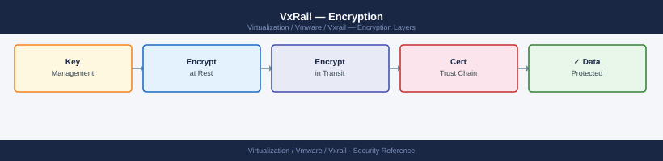

---
tags:
  - security
  - vmware
  - vxrail
---
# VxRail — Encryption

<div class="kb-summary">
Encryption reference for VxRail in the VMware product context. Covers vSAN data-at-rest and in-transit encryption, iDRAC HTTPS enforcement, Secure Boot on ESXi nodes, VxRail Manager TLS, and Native Key Provider backup.

*Applies to: VxRail 7.x / 8.x*
</div>


---

## Before you begin

- **Access:** vCenter Administrator role
- **Change management:** security changes require CAB approval in most environments
- **Rollback plan:** document current state before any security control change
- **Testing:** validate in a non-production environment first where possible

---

## vSAN Data-at-Rest Encryption

### Overview

vSAN data-at-rest encryption protects data stored on node disk groups. When enabled, all data written to vSAN disks is encrypted transparently — VMs do not require any modification.

Encryption keys are managed by:

- **External KMS (KMIP):** A KMIP-compatible key management server (e.g., HyTrust, Thales, HashiCorp Vault with KMIP). The KMS holds the keys and vSAN fetches them at startup.
- **vCenter Native Key Provider (NKP):** A key provider built into vCenter. No separate KMS infrastructure required. Keys are backed by vCenter — NKP must be backed up or keys will be unrecoverable if vCenter is lost.

### Pre-Enable Checklist

> **WARNING: Enabling vSAN data-at-rest encryption on an existing cluster triggers a FULL DATA REBUILD. All data on every disk group is reformatted and rewritten. This process takes several hours depending on the amount of stored data. Data is not lost, but the cluster must have sufficient capacity to tolerate multiple nodes being in rebuild state simultaneously.**

Before enabling vSAN at-rest encryption:

- [ ] Confirm vSAN cluster has more than 25% free capacity — encryption rebuild requires room to rewrite data
- [ ] Schedule a maintenance window of 4–8 hours (more for large clusters or high data volumes)
- [ ] Back up all critical VMs before starting
- [ ] Confirm the KMS or NKP is healthy and accessible from all vCenter management interfaces
- [ ] If using external KMS: confirm KMIP connection from vCenter is green in **vCenter → Configure → Key Providers**
- [ ] Notify application and storage teams — cluster performance will be reduced during the rebuild
- [ ] Confirm vSAN health is all green before starting: no warnings, resync bytes = 0

### Enable vSAN At-Rest Encryption

**vCenter → Cluster → Configure → vSAN → Services → Encryption → Edit → Enable Encryption**

Or via PowerCLI:

```powershell
# Enable vSAN data-at-rest encryption (PowerCLI)
# Ensure a KMS or NKP is already configured and healthy in vCenter before running
Set-VsanClusterConfiguration -Cluster "VxRail-Cluster" -EncryptionEnabled $true
```

```powershell
# Verify vSAN encryption status after enabling (PowerCLI)
Get-VsanClusterConfiguration -Cluster "VxRail-Cluster" |
    Select-Object -ExpandProperty EncryptionConfig |
    Select-Object Enabled, KmsProvider
```

### Monitor the Rebuild

After enabling encryption, monitor resync progress — do not perform any other cluster changes until the rebuild completes.

```powershell
# Monitor vSAN resync progress during encryption rebuild (PowerCLI)
while ($true) {
    $resync = Get-VsanResyncProgress -Cluster "VxRail-Cluster"
    Write-Host "$(Get-Date -Format 'HH:mm:ss') — Resync: $($resync.BytesToSync) bytes remaining"
    if ($resync.BytesToSync -eq 0) { Write-Host "Resync complete."; break }
    Start-Sleep -Seconds 60
}
```

---

## vSAN Data-in-Transit Encryption

### Overview

vSAN in-transit encryption protects vSAN replication traffic flowing between nodes over the vSAN VMkernel network. Key differences from at-rest encryption:

| Feature | At-rest | In-transit |
|---|---|---|
| KMS/NKP required | Yes | No |
| Data rebuild on enable | Yes — FULL REBUILD | No |
| Performance overhead | Minimal (AES-NI) | Minimal (AES-NI) |
| Protects against | Disk theft, physical access | Wire interception on vSAN VLAN |

Enable in-transit encryption on all production VxRail clusters. The overhead is negligible on modern hardware with AES-NI CPU extensions, and no maintenance window or data rebuild is required.

### Enable vSAN In-Transit Encryption

**vCenter → Cluster → Configure → vSAN → Services → Data In-Transit Encryption → Edit → Enable**

```powershell
# Enable vSAN in-transit encryption (PowerCLI)
Set-VsanClusterConfiguration -Cluster "VxRail-Cluster" -DataInTransitEncryptionEnabled $true
```

```powershell
# Verify in-transit encryption state (PowerCLI)
Get-VsanClusterConfiguration -Cluster "VxRail-Cluster" |
    Select-Object -ExpandProperty DataInTransitEncryptionConfig |
    Select-Object Enabled, RekeyInterval
```

In-transit encryption uses a rekey interval (default 30 minutes) to rotate the session keys. The default is appropriate for most environments.

---

## iDRAC HTTPS Enforcement

iDRAC management interfaces must use HTTPS only. HTTP and Telnet provide unencrypted access to the OOB management network and must be disabled.

### Enforce HTTPS, Disable HTTP and Telnet

```bash
# Disable HTTP access on iDRAC (allow HTTPS only)
racadm set iDRAC.Webserver.HttpPort 0
racadm set iDRAC.Webserver.HttpsPort 443

# Disable Telnet (should be disabled by default, verify)
racadm set iDRAC.Serial.Enable 0
```

### Check and Replace the iDRAC SSL Certificate

iDRAC ships with a self-signed certificate. Replace it with a certificate signed by the organisation's internal CA.

```bash
# Check current iDRAC SSL certificate details
racadm sslkeyupload -t 2 -f server.key
racadm sslcertupload -t 2 -f server.crt

# View the currently installed certificate
racadm sslcertview -t 2

# Generate a CSR from iDRAC for CA signing
racadm sslcsrgen -f /tmp/idrac.csr \
  -c "AU" -s "NSW" -l "Sydney" \
  -o "ExampleOrg" -ou "Infra" \
  -cn "idrac-vxrail-node01.example.local"
```

After the CA signs the CSR, upload the signed certificate:

```bash
# Upload signed certificate and key to iDRAC
racadm sslcertupload -t 2 -f /tmp/idrac.crt
racadm sslkeyupload -t 2 -f /tmp/idrac.key
racadm racreset
# iDRAC will restart to apply the new certificate — allow 2 minutes
```

---

## Secure Boot on ESXi Nodes

Secure Boot verifies the digital signatures of ESXi VIBs (software packages) at boot time using UEFI. Any unsigned or tampered VIB causes the boot to fail, protecting against rootkit injection and firmware-level tampering.

All VxRail nodes should have Secure Boot enabled. VxRail LCM includes iDRAC and BIOS firmware updates as part of its upgrade bundles — staying current on LCM versions keeps Secure Boot policies aligned with the installed ESXi version.

### Check Secure Boot Status via RACADM

```bash
# Check Secure Boot status via RACADM on each node
racadm get BIOS.SysProfileSettings.SecureBoot
# Expected output: SecureBoot=Enabled

# Check iDRAC firmware version (kept current by VxRail LCM)
racadm getversion -f idrac

# Check BIOS version
racadm getversion -f bios
```

### Enable Secure Boot via RACADM

```bash
# Enable Secure Boot via RACADM (requires node reboot)
racadm set BIOS.SysProfileSettings.SecureBoot Enabled
racadm jobqueue create BIOS.Setup.1-1 -r pwrcycle -s TIME_NOW
# Node will reboot and apply BIOS settings — allow 5 minutes
```

**Note:** Enabling Secure Boot on a node with unsigned VIBs will prevent ESXi from booting. Confirm all installed VIBs are signed before enabling. VxRail-managed nodes with standard LCM builds will have signed VIBs. Custom VIBs from third-party vendors must be verified before enabling Secure Boot.

---

## VxRail Manager TLS

The VxRail Manager VM exposes its REST API and vCenter plugin endpoint over TLS (port 443). The certificate presented must be valid and trusted by all vCenter instances using the VxRail plugin.

### Certificate Management

VxRail Manager ships with a self-signed certificate. Replace with a CA-signed certificate for production use.

**Replace VxRail Manager TLS certificate:**

```bash
# Upload a CA-signed certificate and key to VxRail Manager
curl -sk \
  -X POST \
  -H "Authorization: Basic $(echo -n 'mystic:password' | base64)" \
  -F "certificate=@/tmp/vxrail-manager.crt" \
  -F "private_key=@/tmp/vxrail-manager.key" \
  "https://<vxrail-manager-ip>/rest/vxm/v1/system/certificate"
```

After uploading, VxRail Manager will restart its web service to apply the new certificate. Allow 2–3 minutes for the service to come back online. Reconnect the vCenter plugin after the certificate change.

### Certificate Renewal

VxRail Manager certificates must be renewed before expiry. Set a calendar reminder 60 days before the certificate expiration date. The renewal process is identical to the initial upload — generate a new CSR, have it signed by the CA, and upload via the API.

```bash
# Generate a new CSR from VxRail Manager
curl -sk \
  -X POST \
  -H "Authorization: Basic $(echo -n 'mystic:password' | base64)" \
  -H "Content-Type: application/json" \
  -d '{
    "common_name": "vxrail-manager.example.local",
    "country": "AU",
    "state": "NSW",
    "locality": "Sydney",
    "organization": "ExampleOrg",
    "organizational_unit": "Infra"
  }' \
  "https://<vxrail-manager-ip>/rest/vxm/v1/system/certificate/csr" \
  -o /tmp/vxrail-manager.csr
```

---

## Native Key Provider Backup

If vSAN at-rest encryption is configured using the vCenter Native Key Provider (NKP), the NKP key material must be backed up. If vCenter is lost without an NKP backup, encrypted vSAN data will be unrecoverable.

### Download the NKP Backup

**vCenter → Administration → Key Providers → [NKP Name] → Backup**

This downloads an encrypted `.p12` file containing the key material. The backup file is itself password-protected.

```powershell
# Verify NKP is healthy and the cluster is using it (PowerCLI)
Get-KeyProvider | Select-Object Name, Type, Connected, Primary
Get-VsanClusterConfiguration -Cluster "VxRail-Cluster" |
    Select-Object -ExpandProperty EncryptionConfig |
    Select-Object KmsProvider
```

### NKP Backup Storage Requirements

| Requirement | Detail |
|---|---|
| Storage location | Offline from vCenter — different system, different storage |
| Encryption | The `.p12` backup file is password-protected; store the password in vault |
| Copies | Minimum 2 copies in different physical locations |
| Frequency | Re-download after every NKP key rotation or vCenter upgrade |
| Test recovery | Verify NKP backup is readable annually using a test vCenter instance |

Store the NKP backup password and `.p12` file in separate vault entries. An attacker who obtains both can decrypt vSAN data if they also gain access to the encrypted disks.

## See also

- [VxRail — Hardening](../hardening/)
- [VxRail — Health Checks](../../operations/health-checks/)
