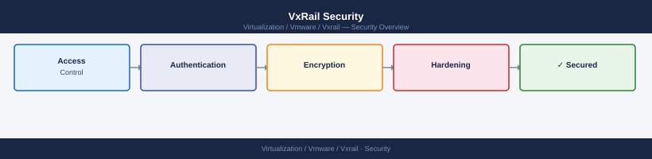

---
tags:
  - security
  - vxrail
---
# VxRail Security


<div class="kb-summary">
VxRail security: vCenter SSO integration, VxRail Manager account lockout policy, TLS 1.2 enforcement, SCG certificate management, and role separation for VxRail Admin.

*Applies to: VxRail 7.x / 8.x*
</div>



---

```d2
direction: down

external: External / Untrusted {shape: rectangle}
hardening_checklist: "Hardening Checklist" {shape: rectangle}
idrac_hardening: "iDRAC Hardening" {shape: rectangle}
esxi_lockdown_mode: "ESXi Lockdown Mode" {shape: rectangle}
vsan_encryption: "vSAN Encryption" {shape: rectangle}
certificate_management: "Certificate Management" {shape: rectangle}
vcenter_rbac: "vCenter RBAC" {shape: rectangle}
core: "VxRail Core" {shape: hexagon}

external -> hardening_checklist: traffic in
hardening_checklist -> idrac_hardening
idrac_hardening -> esxi_lockdown_mode
esxi_lockdown_mode -> vsan_encryption
vsan_encryption -> certificate_management
certificate_management -> vcenter_rbac
vcenter_rbac -> core: secured path
```

## Before you begin

- **Access:** vCenter Administrator role
- **Change management:** security changes require CAB approval in most environments
- **Rollback plan:** document current state before any security control change
- **Testing:** validate in a non-production environment first where possible

---

## Hardening Checklist

- [ ] All iDRAC default credentials changed; iDRAC access restricted to management VLAN
- [ ] iDRAC audit logging enabled on all nodes
- [ ] Secure Boot enabled on all nodes (where supported by node generation)
- [ ] ESXi lockdown mode enabled (Normal minimum; Strict for high-security environments)
- [ ] ESXi root password changed from default; stored in vault; local access via break-glass only
- [ ] vSAN data-at-rest encryption enabled for clusters handling sensitive data
- [ ] VxRail Manager and ESXi certificates replaced with CA-signed certs via VxRail Manager workflow
- [ ] vCenter RBAC scoped — VxRail operator role mapped to an AD group; no shared admin credentials
- [ ] SNMP community strings managed via vault; v3 preferred over v2c
- [ ] Syslog forwarding from ESXi hosts to SIEM configured

---

## iDRAC Hardening

Each VxRail node has a dedicated iDRAC management interface. Harden at deployment:

```bash
# From iDRAC RACADM CLI — set a strong password for the root account
racadm set iDRAC.Users.2.Password <new-password>

# Disable unused interfaces (serial, local RACADM if not required)
racadm set iDRAC.LocalSecurity.LocalConfig 0

# Enable iDRAC audit logging
racadm set iDRAC.AuditLog.Enable 1

# Restrict iDRAC to management network subnet (IP filter)
racadm set iDRAC.IPBlocking.BlockEnable 1
racadm set iDRAC.IPBlocking.RangeAddr <mgmt-subnet>
racadm set iDRAC.IPBlocking.RangeMask <subnet-mask>
```

---

## ESXi Lockdown Mode

Lockdown mode forces all ESXi management through vCenter, preventing direct host access.

| Mode | Effect |
|---|---|
| Normal lockdown | Direct API and SSH access disabled; DCUI still accessible |
| Strict lockdown | DCUI also disabled; only vCenter can manage the host |

**Enable via PowerCLI:**

```powershell
# Enable Normal lockdown on all hosts in a cluster
Get-Cluster "VxRailCluster" | Get-VMHost | ForEach-Object {
  ($_ | Get-View).EnterLockdownMode()
}

# Check lockdown state
Get-VMHost | Select Name, @{N="Lockdown";E={$_.ExtensionData.Config.LockdownMode}}
```

**Exception list** (accounts that can access even in lockdown mode):

```powershell
# View exception users
Get-VMHost "vxr-host" | Get-View | Select -ExpandProperty Config | Select -ExpandProperty LockdownExceptionUsers
```

---

## vSAN Encryption

For workload domains with sensitive data requirements:

1. Deploy and configure a KMS (Key Management Server) — the KMS must be HA-redundant.
2. In vCenter → Cluster → Configure → vSAN → Services → Data-at-Rest Encryption → Enable.
3. Accept the warning about re-formatting disk groups (initial enablement triggers a rolling disk group reformat — plan for resync time).
4. Configure key rotation schedule per policy.

**Verify encryption is active:**

```bash
# From ESXi on a VxRail node
esxcli vsan debug object list | grep -i "encrypt"

# PowerCLI
Get-Cluster | Get-View | Select -ExpandProperty ConfigurationEx | Select -ExpandProperty VsanConfigInfo
```

---

## Certificate Management

VxRail Manager orchestrates certificate replacement for both ESXi hosts and VxRail Manager itself.

```text
VxRail Manager UI → System → Certificates → Replace Certificate
```

**ESXi host certificate renewal:**

- This is done via VxRail Manager, not directly through vCenter.
- VxRail Manager will push the certificate to all nodes in the cluster.
- Schedule during a low-risk window — the certificate replacement causes a brief disruption to the vCenter-host connection.

**VxRail Manager certificate renewal:**

1. Generate a CSR from VxRail Manager → System → Certificates → Generate CSR.
2. Submit to internal CA and receive the signed cert.
3. Import via VxRail Manager → System → Certificates → Upload Certificate.

---

## vCenter RBAC

VxRail does not require vCenter Admin on the cluster for routine operations — scope access appropriately.

| Role | Scope | Purpose |
|---|---|---|
| VxRail Administrator | VxRail cluster object | Full VxRail Manager and LCM operations |
| vCenter Administrator | Management domain vCenter | Break-glass only |
| Read-Only | VxRail cluster | Monitoring-only access |

Map these roles to AD groups — avoid assigning roles to individual AD user accounts.

---

## Syslog Forwarding

```powershell
# Configure syslog forwarding on all VxRail ESXi hosts
Get-Cluster "VxRailCluster" | Get-VMHost | ForEach-Object {
  Set-VMHostSysLogServer -VMHost $_ -SysLogServer "udp://<siem-ip>:514"
  Restart-VMHostService -VMHost $_ -Key "syslog" -Confirm:$false
}

# Verify syslog is configured
Get-VMHost | Get-VMHostSysLogServer
```
