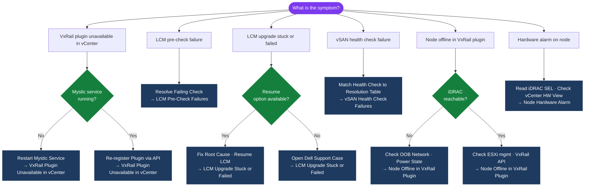

---
tags:
  - troubleshooting
  - vmware
  - vxrail
search:
  boost: 1.5
---
# VxRail — Common Issues

<div class="kb-summary">
Concrete troubleshooting steps for the most frequent VxRail operational problems: plugin unavailability, LCM upgrade failures, vSAN health degradation, node offline conditions, and hardware alarms.

*Applies to: VxRail 7.x / 8.x*
</div>

```text
┌─────────────────────────────────────── VxRail — Common Issues ────────────────────────────────────────┐
│                                                                                                       │
│   ┌───────────────────────────────────────────────────────────────────────────────────────────┐       │
│   │  Symptom categories and first triage step for each                                        │       │
│   │  Plugin unavailable → restart Mystic service on VxRail Manager VM                        │        │
│   │  LCM pre-check fails → resolve vSAN health / resync / credentials before retrying        │        │
│   │  LCM upgrade stuck → check lcm.log; retry via Plugin → LCM → Resume Upgrade             │         │
│   │  vSAN health failure → match health check name to resolution table below                 │        │
│   │  Node offline → ping iDRAC → ping ESXi mgmt → query VxRail API                          │         │
│   │  Hardware alarm → racadm getsel → check vCenter host Hardware view                       │        │
│   └───────────────────────────────────────────────────────────────────────────────────────────┘       │
│                                                                                                       │
│   Plugin Issues      LCM Failures       vSAN Degraded      Node Offline       HW Alarms               │
│        │                  │                   │                  │                 │                  │
│        ▼                  ▼                   ▼                  ▼                 ▼                  │
│   Restart Mystic    Fix pre-check       Health check      Ping iDRAC/ESXi    racadm getsel            │
│   Re-register       root cause          table below       VxRail API         iDRAC SEL log            │
│   plugin            Resume LCM          Replace disk/     Return to svc      vCenter HW view          │
│                                         node              or remove node                              │
│                                                                                                       │
│   Key terms:                                                                                          │
│   Mystic service   = VxRail Manager daemon; restart recovers plugin and API connectivity              │
│   LCM pre-check    = Validation gate before upgrade; must pass all checks to proceed                  │
│   vSAN Degraded    = Object has fewer copies than FTT policy requires; still accessible               │
│   vSAN Absent      = Object component is completely offline / inaccessible                            │
│   MTU mismatch     = Physical switch port and vmkernel MTU must both be 9000 for jumbo frames         │
│   iDRAC SEL        = System Event Log on iDRAC; records hardware faults chronologically               │
│                                                                                                       │
└───────────────────────────────────────────────────────────────────────────────────────────────────────┘
```

---

## Diagnostic Flow



---

## Before you begin

- **Access:** SSH to vCenter Shell and ESXi hosts; vSphere Client read access
- **Gather first:** recent error message text, event timestamps, and affected object names
- **Scope:** confirm whether the issue affects a single object, host, cluster, or site
- **Escalation:** open a vendor support ticket before running any destructive step
- **Logging:** document each command and output — required if escalation is needed

---

## VxRail Plugin Unavailable in vCenter

### Symptoms

- vCenter shows "VxRail" plugin as unavailable or grayed out
- VxRail tab in vCenter is missing or fails to load
- VxRail Manager UI is inaccessible at `https://<vxrail-manager-ip>`

### Triage Sequence

**Step 1 — Confirm VxRail Manager VM is powered on**

In vCenter, locate the VxRail Manager VM (usually named `VxRail-Manager` or `vxm`). Verify it is powered on and the guest OS is responsive (open console).

**Step 2 — Restart the Mystic service**

```bash
# SSH to VxRail Manager
ssh mystic@<vxrail-manager-ip>

# Check service status
sudo systemctl status mystic

# Restart the Mystic service
sudo systemctl restart mystic

# Confirm service returned to running state
sudo systemctl status mystic
```

Allow 2–3 minutes for the service to fully initialise before rechecking the plugin in vCenter.

**Step 3 — Check plugin registration in vCenter**

```bash
# From VxRail Manager, trigger plugin re-registration
curl -sk -X POST \
  -H "Authorization: Basic $(echo -n 'mystic:password' | base64)" \
  -H "Content-Type: application/json" \
  "https://localhost/rest/vxm/v1/plugin/register"
```

Then log out of vCenter and log back in — browser-cached plugin state is refreshed on session start.

**Step 4 — Verify vCenter extension is registered**

In vCenter: **Administration → Client Plug-ins** — confirm the VxRail plugin is listed and status shows `Deployed`. If it shows `Failed` or is absent, re-run the registration call above and restart the vCenter UI service if needed.

### Common Causes

| Cause | Resolution |
|---|---|
| VxRail Manager VM rebooted after patching | Wait for Mystic service to fully start; check systemctl status |
| Mystic service crashed | Restart via systemctl; check mystic.log for crash cause |
| vCenter plugin cache stale | Log out and back in to vCenter; clear browser cache |
| vCenter credentials changed in VxRail Mgr | Update vCenter credentials under VxRail Plugin → System → vCenter |
| VxRail Manager IP changed | Re-register plugin pointing to new IP |

---

## LCM Pre-Check Failures

LCM (Lifecycle Manager) runs a pre-check validation before every upgrade. All checks must pass before the upgrade proceeds.

### Pre-Check Failure Resolution Table

| Pre-Check Failure | Root Cause | Resolution |
|---|---|---|
| vSAN health not green | One or more vSAN health checks are failing | Resolve all vSAN health issues; rerun pre-check |
| vSAN resync active | vSAN is currently rebuilding objects between nodes | Wait for resync to complete (`esxcli vsan debug resync list`); rerun pre-check |
| Node unreachable | LCM cannot reach a node's ESXi management or iDRAC IP | Ping the node from VxRail Manager; restore network connectivity |
| Bundle compatibility | Upgrade bundle does not match current cluster version | Download the correct bundle for your VxRail version from dell.com/support |
| vCenter credentials invalid | The vCenter credentials stored in VxRail Manager have expired | Update credentials: VxRail Plugin → System → vCenter Credentials |
| DRS not Fully Automated | LCM needs DRS to migrate VMs during maintenance mode entry | Set DRS to Fully Automated on the cluster before retrying |
| Time skew detected | NTP mismatch between VxRail Manager and vCenter/ESXi hosts | Sync all components to the same NTP source |
| Insufficient disk capacity | vSAN does not have enough free capacity for the upgrade | Add storage or remove unnecessary data before retrying |

### Checking Pre-Check Status via API

```bash
# SSH to VxRail Manager and query current LCM pre-check results
curl -sk \
  -H "Authorization: Basic $(echo -n 'mystic:password' | base64)" \
  "https://localhost/rest/vxm/v1/lcm/upgrade/plan" | python3 -m json.tool
```

### Verifying vSAN Resync Completion

```bash
# SSH to any ESXi node in the cluster
# Show active resync objects (empty output = resync complete)
esxcli vsan debug resync list

# Show resync bytes remaining
esxcli vsan debug resync summary
```

Wait until resync bytes reach zero before retrying the LCM pre-check.

---

## LCM Upgrade Stuck or Failed

### Log Check Commands

```bash
# SSH to VxRail Manager
ssh mystic@<vxrail-manager-ip>

# Tail the LCM log for errors
sudo tail -200 /var/log/mystic/lcm.log | grep -i "error\|fail\|exception\|timeout"

# Check LCM upgrade status via API
curl -sk \
  -H "Authorization: Basic $(echo -n 'mystic:password' | base64)" \
  "https://localhost/rest/vxm/v1/lcm/upgrade" | python3 -m json.tool

# Check VxRail Manager main log for related events
sudo tail -200 /var/log/mystic/mystic.log | grep -i "lcm\|upgrade\|error"
```

### LCM Failure Points Table

| Failure Stage | Likely Cause | Resolution |
|---|---|---|
| Stuck at pre-check | Pre-check item not resolved | Resolve the failing check (see table above); resume upgrade |
| Node firmware update fails | iDRAC connectivity lost mid-upgrade | Ping iDRAC IP; restart iDRAC via racadm; retry via Resume |
| ESXi VIB install fails | VIB acceptance level mismatch | Run `esxcli software acceptance get` on the affected node; set to `CommunitySupported` if needed |
| vCenter VCSA upgrade fails | VAMI port 5480 unreachable | Verify vCenter VAMI is accessible; check vCenter VM console |
| Upgrade hangs at maintenance mode | DRS not migrating VMs | Confirm DRS is Fully Automated; check for affinity rules blocking VM migration |
| Upgrade hangs at firmware stage | Firmware bundle mismatch | Check iDRAC firmware version; review lcm.log for bundle validation errors |
| Upgrade reports success but node unhealthy | Post-upgrade health check failed | Check node health in VxRail Plugin; review vmkernel.log on the affected node |

### Resume a Failed LCM Upgrade

Most LCM failures can be recovered without starting over:

1. Identify and resolve the root cause from lcm.log
2. In vCenter, navigate to: **VxRail Plugin → LCM → Resume Upgrade**
3. Confirm the pre-checks pass before proceeding

If Resume is not available or fails repeatedly, do not attempt to manually upgrade ESXi or firmware on individual VxRail nodes — this risks putting the cluster into an unsupported mixed-version state. Open a Dell support case instead.

---

## vSAN Health Check Failures

### Health Check Resolution Table

| Health Check | Failure Meaning | Resolution |
|---|---|---|
| vSAN Build Recommendation | Component versions don't match across nodes | Run LCM upgrade to bring all nodes to the same version |
| Disk Balance | Disks heavily unbalanced across disk groups | Trigger vSAN rebalance: **vSAN → Rebalance** in vCenter |
| MTU Check (Jumbo Frames) | Jumbo frames not end-to-end on vSAN network | Verify physical switch MTU 9000 on all vSAN-facing ports; see MTU section below |
| vSAN Network Connectivity | Node cannot reach peers on vSAN vmkernel network | Check vSAN vmkernel IP; verify VLAN and routing |
| Capacity — Space Utilisation > 70% | Cluster filling up | Add nodes, reduce VM footprint, or remove snapshots; see Capacity section below |
| Component State (Degraded/Absent) | One or more components offline | Check disk health; replace failed disk; restore offline node |
| Performance Service | vSAN performance service not enabled | Enable performance service: **vSAN → Services → Performance Service** |
| Time Synchronisation | NTP skew between nodes | Sync all ESXi hosts and VxRail Manager to the same NTP source |

### vSAN MTU Failure — vmkping Test

```bash
# SSH to an ESXi node in the cluster
# Test jumbo frames to a peer node's vSAN vmkernel IP
# -d = don't fragment, -s 8972 = maximum payload for 9000-byte MTU frame
vmkping -I vmk2 -d -s 8972 <remote-node-vsan-vmkernel-ip>

# If the ping fails with "Message too long": switch port MTU is not 9000
# If the ping fails with "Destination host unreachable": routing or VLAN issue

# Verify vSAN vmkernel interface assignment
esxcli network ip interface list | grep vmk

# Test connectivity to all peer nodes
vmkping -I vmk2 <node2-vsan-vmk-ip>
vmkping -I vmk2 <node3-vsan-vmk-ip>
vmkping -I vmk2 <node4-vsan-vmk-ip>
```

**Switch port verification:** On the physical ToR switch, confirm that the ports connected to the vSAN uplinks have `mtu 9000` (or equivalent for the switch vendor). Both the switch port and the ESXi vmkernel MTU must be set to 9000.

### vSAN Network Connectivity Test

```bash
# Run the built-in vSAN network test tool
esxcli vsan debug network test

# Verify vmkernel tags — vmk2 must have vSAN traffic type
esxcli vsan network list
```

---

## vSAN Degraded and Absent Objects

### Degraded vs Absent — Key Distinction

| State | Meaning | VM Impact | Action |
|---|---|---|---|
| Degraded | Object has fewer copies than FTT policy; still accessible | VM running, reduced redundancy | Monitor resync; fix disk/node |
| Absent | Object component is completely offline | VM may be inaccessible or paused | Return node/disk to service immediately |

### Monitoring Resync Progress

```bash
# SSH to any ESXi node in the cluster
# List objects currently resyncing
esxcli vsan debug resync list

# Show total bytes remaining in resync
esxcli vsan debug resync summary

# Check vSAN object health in detail
esxcli vsan debug object list | grep -i "degraded\|absent"
```

### Degraded Object Recovery

1. Identify which disk or node is causing the degradation
2. vSAN automatically rebuilds onto available nodes/disks — allow resync to complete
3. Monitor resync bytes with the commands above
4. If caused by a failed disk: replace the disk and add the replacement to the disk group
5. If caused by an offline node: return the node to service (remove from maintenance mode)

### Absent Object Recovery

1. Check if the node hosting the absent component is powered off or in maintenance mode
2. Power on / remove from maintenance mode — vSAN rehydrates the absent components automatically
3. If the node is permanently lost: remove it from the cluster; vSAN rebuilds from remaining copies provided FTT ≥ 1 on the storage policy
4. If FTT = 0 and the node is lost, VMs on that node's objects are inaccessible — restore from backup

### Disk Replacement Trigger

A disk should be replaced when:

- The disk shows a `Permanent Device Loss (PDL)` condition
- iDRAC reports predictive failure on the disk
- vSAN health shows a disk as degraded for more than 60 minutes with no rebuild activity

```bash
# Check disk health on a specific ESXi host
esxcli storage core device list | grep -i "state\|health"

# Check for PDL/APD conditions
esxcli storage core path list | grep -i "dead\|off"
```

---

## vSAN Capacity Issues

### Capacity Check Commands

```bash
# Check cluster-level capacity utilisation
esxcli vsan storage stats get

# Show per-disk group capacity
esxcli vsan storage diskgroup list
```

```powershell
# PowerCLI — identify VMs using the most vSAN space
Get-VM | Sort-Object {$_.UsedSpaceGB} -Descending | `
  Select-Object -First 10 Name, UsedSpaceGB, ProvisionedSpaceGB

# Check for snapshot accumulation (large deltas consuming vSAN space)
Get-VM | Get-Snapshot | `
  Select-Object VM, Name, Created, SizeGB | `
  Sort-Object SizeGB -Descending
```

### Snapshot Accumulation Check

Orphaned or old snapshots are a common cause of unexpected capacity consumption. Run the PowerCLI snapshot query above and delete snapshots older than your retention policy.

### Capacity Expansion Options

| Option | When to Use |
|---|---|
| Delete orphaned snapshots | Immediately recoverable space; low risk |
| Thin-provision review | Reclaim overprovisioned space |
| Add storage nodes | Preferred expansion for permanent growth |
| Add capacity-tier disk groups | Add HDDs/SSDs to existing nodes if slots available |
| Storage policy change | Reduce FTT from 2 to 1 to recover ~33% capacity (increases risk) |

---

## Node Offline in VxRail Plugin

### Reachability Check Sequence

Work through these steps in order — each confirms a layer of reachability.

```bash
# Step 1: Can you reach the node's iDRAC (OOB management)?
ping <node-idrac-ip>
# If no ping: check OOB network; verify node is physically powered on

# Step 2: Can you reach the node's ESXi management vmkernel (vmk0)?
ping <node-mgmt-vmk0-ip>
# If no ping but iDRAC responds: ESXi has a management network issue

# Step 3: SSH to VxRail Manager and query VxRail API for node status
ssh mystic@<vxrail-manager-ip>

curl -sk \
  -H "Authorization: Basic $(echo -n 'mystic:password' | base64)" \
  "https://localhost/rest/vxm/v1/hosts" | python3 -c "
import sys, json
d = json.load(sys.stdin)
for h in d:
    print(f'{h.get(\"sn\",\"?\")}  slot={h.get(\"slot\",\"?\")}  '
          f'state={h.get(\"operational_status\",\"?\")}  '
          f'health={h.get(\"health\",\"?\")}')
"
```

### Node Status Interpretation

| API `operational_status` | Meaning | Action |
|---|---|---|
| `NORMAL` | Node healthy and in cluster | No action needed |
| `MAINTENANCE` | Node in maintenance mode | Intended if you put it there; otherwise remove from MM |
| `POWERED_OFF` | Node is off | Power on via iDRAC web UI or racadm |
| `ERROR` | Node reporting a fault | Check iDRAC SEL; check VxRail Manager mystic.log |
| `UNKNOWN` | VxRail Manager cannot reach node | Check network; restart Mystic; check ESXi hostd |

### Rejoining the Cluster After Maintenance

```bash
# Remove ESXi host from maintenance mode (run from vCenter via PowerCLI)
# or use vCenter UI: right-click host → Exit Maintenance Mode
```

```powershell
# PowerCLI — exit maintenance mode
$vmhost = Get-VMHost -Name "<esxi-hostname>"
Set-VMHost -VMHost $vmhost -State Connected
```

After the host reconnects to vCenter, VxRail Manager will detect it and update the plugin status within a few minutes. vSAN will begin resyncing any absent components automatically.

---

## Node Hardware Alarm

### iDRAC SEL Check

```bash
# SSH to the node's iDRAC
ssh root@<node-idrac-ip>

# View the last 30 entries in the System Event Log
racadm getsel | tail -30

# Filter for critical/warning events
racadm getsel | grep -i "critical\|warning\|fault"

# Get full system information including fault summary
racadm getsysinfo | grep -i "fault\|warning\|critical"

# Check current sensor readings (fans, temps, PSU)
racadm getsysinfo -t pwrsupply
racadm getsysinfo -t fan
racadm getsysinfo -t temp
```

### Interpreting Common iDRAC Alarms

| Alarm Type | Severity | Action |
|---|---|---|
| Disk predictive failure | Warning | Schedule disk replacement; monitor vSAN health |
| Disk failure | Critical | Replace disk immediately; check vSAN object health |
| PSU failure / redundancy lost | Warning/Critical | Replace PSU; verify second PSU is active |
| Fan failure | Critical | Replace fan; check thermal status of node |
| Memory correctable ECC error | Warning | Monitor; replace DIMM if errors accumulate |
| Memory uncorrectable ECC error | Critical | Replace DIMM; may require ESXi host reboot |
| NIC link down | Warning | Check cable; check switch port; verify vmkernel connectivity |
| Thermal warning | Warning | Check airflow; verify CRAC/cooling in the rack |

### vCenter Hardware View

Hardware alarms are also visible in vCenter when iDRAC integration is active:

**vCenter → Host → Monitor → Hardware**

This view shows current hardware health from the Dell OpenManage integration, including disk, PSU, and fan status without needing to log in to iDRAC separately.

### RACADM Remote Access (If SSH Unavailable)

```bash
# Use racadm remotely from a management host with DRAC tools installed
racadm -r <idrac-ip> -u root -p <password> getsel
racadm -r <idrac-ip> -u root -p <password> getsysinfo
```

---

## Verify resolution

- **Alarms cleared:** Home → Alarms — the triggering alarm is no longer active
- **Event log:** confirm no new related error events in the last 5 minutes
- **Functional test:** perform the action that was failing (connect, vMotion, storage I/O) — confirm it succeeds
- **Monitor:** leave the vSphere Client open for 10 minutes and confirm the issue does not recur
