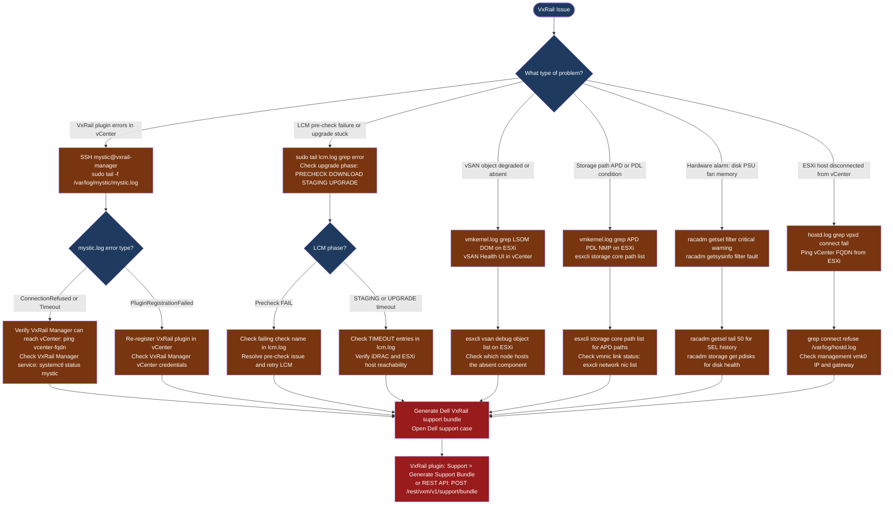

---
tags:
  - troubleshooting
  - vmware
  - vxrail
search:
  boost: 1.5
---
# VxRail — Diagnostics

<div class="kb-summary">
VxRail diagnostic commands: tail VxRail Manager mystic.log and lcm.log, grep ESXi vmkernel.log for vSAN LSOM/DOM errors, collect iDRAC SEL hardware event logs with racadm, and generate the Dell VxRail support bundle via the plugin UI or REST API.

*Applies to: VxRail 7.x / 8.x*
</div>

```text
┌──────────────────────────────────────── VxRail — Diagnostics ─────────────────────────────────────────┐
│                                                                                                       │
│   ┌───────────────────────────────────────────────────────────────────────────────────────────────┐   │
│   │  Start here: choose log source based on symptom type                                         │    │
│   │  VxRail Manager logs  → plugin issues, LCM failures, API errors                              │    │
│   │  ESXi host logs       → vSAN I/O errors, storage path issues, hostd failures                 │    │
│   │  iDRAC diagnostics    → hardware faults: disk, PSU, fan, NIC, memory                         │    │
│   │  Dell support bundle  → full cluster snapshot for escalation to Dell GSS                     │    │
│   └───────────────────────────────────────────────────────────────────────────────────────────────┘   │
│                                                                                                       │
│   ┌──────────────────────────────────────────────┐  ┌─────────────────────────────────────────────┐   │
│   │         VxRail Manager Log Sources           │  │         ESXi and Hardware Sources           │   │
│   │   mystic.log — plugin, API, node discovery   │  │   vmkernel.log — vSAN LSOM/DOM/NMP/APD      │   │
│   │   lcm.log — upgrade phases and pre-checks    │  │   hostd.log — host management, vCenter      │   │
│   │   access.log — REST API 4xx/5xx errors       │  │   iDRAC SEL — disk/PSU/fan/memory faults   │    │
│   │   SSH: ssh mystic@<vxrail-manager-ip>        │  │   vm-support — full ESXi diagnostic bundle  │   │
│   └──────────────────────────────────────────────┘  └─────────────────────────────────────────────┘   │
│                                                                                                       │
│  Physical Infrastructure:                                                                             │
│  VxRail nodes (Dell PowerEdge hardware) · VxRail Manager VM · per-node iDRAC BMC interface            │
│  vSAN storage on local NVMe/SSD · ESXi hypervisor · VxRail plugin registered in vCenter               │
│                                                                                                       │
│  Key terms:                                                                                           │
│  Mystic service   = VxRail Manager daemon; mystic.log is the primary VxRail Manager log               │
│  LSOM             = Local Log-Structured Object Manager; vSAN storage layer; errors in vmkernel       │
│  DOM              = Distributed Object Manager; vSAN object distribution across nodes                 │
│  hostd            = ESXi host management daemon; logs VM and management operations                    │
│  iDRAC SEL        = System Event Log; chronological record of all hardware events on the node         │
│  racadm           = Remote Access Controller CLI; runs against iDRAC for hardware commands            │
│  vm-support       = ESXi built-in command; collects full diagnostic bundle including all logs         │
│  Support bundle   = Dell/VxRail compressed archive; contains all logs for a support case              │
│  APD              = All Paths Down; storage device unreachable (temporary)                            │
│  PDL              = Permanent Device Loss; storage device permanently unreachable                     │
│                                                                                                       │
└───────────────────────────────────────────────────────────────────────────────────────────────────────┘
```



## Before you begin

- **Access:** SSH to VxRail Manager (`mystic@<vxrail-manager-ip>`); ESXi root SSH access; iDRAC SSH or racadm remote access; vCenter admin credentials
- **Gather first:** the specific symptom (plugin error, LCM pre-check name, vSAN health alarm, iDRAC hardware alert), the affected node IP or service tag, and when the issue started
- **Scope:** confirm whether the issue affects one node, one VxRail cluster, or the vCenter-VxRail integration layer

---

## Step 1 — Check VxRail Manager logs

```bash
# SSH to VxRail Manager
ssh mystic@<vxrail-manager-ip>

# List all log files with sizes
sudo ls -lh /var/log/mystic/

# mystic.log — Main VxRail Manager daemon log
sudo tail -500 /var/log/mystic/mystic.log
sudo tail -500 /var/log/mystic/mystic.log | grep -i "error\|exception\|critical\|fail"

# Watch live during active troubleshooting
sudo tail -f /var/log/mystic/mystic.log

# lcm.log — LCM upgrade operations
sudo tail -200 /var/log/mystic/lcm.log | grep -i "error\|fail\|exception\|timeout"

# Find a specific upgrade run by date
sudo grep "2026-06-15" /var/log/mystic/lcm.log | grep -i "error\|fail"

# access.log — REST API call history and error codes
sudo grep " 5[0-9][0-9] " /var/log/mystic/access.log | tail -50   # server errors
sudo grep " 401 " /var/log/mystic/access.log | tail -20            # auth failures
```

LCM phase sequence to check in lcm.log:

| Phase | What to look for |
|---|---|
| PRECHECK | `precheck.*FAIL` — check name tells you what to fix |
| DOWNLOAD | `download.*fail\|bundle.*error` — depot/proxy issue |
| STAGING | `TIMEOUT` — iDRAC or ESXi unreachable during staging |
| UPGRADE | `stage.*failed` — check the specific failing component |
| POSTCHECKS | `postcheck.*fail` — verify node health after upgrade |

---

## Step 2 — Check ESXi host logs

```bash
# SSH to the affected ESXi host
ssh root@<esxi-host-ip>

# vmkernel.log — vSAN storage layer and network errors
tail -200 /var/log/vmkernel.log | grep -i "vsan\|LSOM\|DOM"
tail -200 /var/log/vmkernel.log | grep -i "APD\|PDL\|NMP\|path"
tail -200 /var/log/vmkernel.log | grep -i "vmnic\|uplink\|link down"

# Wider search window
grep -i "LSOM\|error" /var/log/vmkernel.log | tail -200

# hostd.log — Host management and vCenter connection
tail -200 /var/log/hostd.log | grep -i "error\|fail"
grep -i "vpxd\|vCenter\|connect" /var/log/hostd.log | tail -50

# Storage path status
esxcli storage core path list | grep -v "Active"
# Expected: all paths Active; problem: Dead, Standby (unexpected)

# vSAN object list on this host
esxcli vsan debug object list 2>/dev/null | head -30
```

vmkernel.log patterns:

| Pattern | Meaning |
|---|---|
| `LSOM: disk ... failed` | Local disk failure — check iDRAC SEL |
| `DOM: component ... absent` | vSAN object component absent; node may be offline |
| `NMP: no more paths` | All paths dead — PDL condition |
| `APD START` | All Paths Down — storage temporarily unreachable |
| `vmnic ... link state changed to down` | NIC link dropped — check cable or switch port |
| `VSAN: network partition` | Nodes cannot communicate on vSAN vmkernel network |

---

## Step 3 — Check iDRAC for hardware faults

```bash
# SSH to node iDRAC
ssh root@<node-idrac-ip>

# Or use racadm remotely from a management host
racadm -r <idrac-ip> -u root -p <password> getsel

# System Event Log — primary hardware fault source
racadm getsel | tail -50
racadm getsel | grep -i "critical\|warning\|fault"

# Full system summary
racadm getsysinfo | grep -i "fault\|warning\|critical"

# Power supply status
racadm getsysinfo -t pwrsupply

# Fan status (failure causes thermal shutdown)
racadm getsysinfo -t fan

# Disk and RAID controller health
racadm storage get pdisks -o -p State,PredictiveFailureState,MediaType
racadm storage get controllers -o

# NIC link status
racadm getniccfg -n NIC.Integrated.1-1

# Temperature readings
racadm getsysinfo -t temp

# Quick hardware diagnostic test
racadm diagnostics run -t QuickTest
```

SEL patterns to look for:

| SEL Entry | Meaning |
|---|---|
| `Physical Disk ... Predictive Failure` | Disk imminent failure — plan replacement |
| `Physical Disk ... Failed` | Disk has failed — replace immediately |
| `Power Supply ... Failure` | PSU failed — check and replace |
| `Memory ... Correctable ECC` | Single-bit memory error — monitor |
| `Memory ... Uncorrectable ECC` | Multi-bit error — DIMM replacement required |
| `Network interface ... link down` | NIC link lost — check cable and switch |

---

## Step 4 — Collect vm-support ESXi bundle

```bash
# Collect full ESXi diagnostic bundle (does not impact running VMs)
ssh root@<esxi-host-ip>
vm-support -n -w /tmp/
# Duration: 2-5 minutes

# List the generated bundle file
ls -lh /tmp/*.tgz

# SCP to management workstation
scp root@<esxi-host-ip>:/tmp/esx-<hostname>-<timestamp>.tgz ./
```

The vm-support bundle includes: vmkernel.log, hostd.log, vpxa.log, network config, storage config, and running process state.

---

## Step 5 — Generate Dell VxRail support bundle

### Via VxRail plugin (UI path)

Navigate to: **VxRail Plugin → Support → Generate Support Bundle**

Bundle generation takes 10–20 minutes. The download link appears when complete. Contents: VxRail Manager logs, node health data, iDRAC logs, and ESXi log excerpts from all nodes.

### Via VxRail Manager API

```bash
# SSH to VxRail Manager
ssh mystic@<vxrail-manager-ip>

# Trigger bundle generation
curl -sk -X POST \
  -H "Authorization: Basic $(echo -n 'mystic:password' | base64)" \
  -H "Content-Type: application/json" \
  "https://localhost/rest/vxm/v1/support/bundle"
# Returns: JSON with job_id

# Poll job status
curl -sk \
  -H "Authorization: Basic $(echo -n 'mystic:password' | base64)" \
  "https://localhost/rest/vxm/v1/requests/<job-id>" | python3 -m json.tool

# When status = COMPLETED, download the bundle
curl -sk -O \
  -H "Authorization: Basic $(echo -n 'mystic:password' | base64)" \
  "https://localhost/rest/vxm/v1/support/bundle/download"
```

---

## Log locations

| Log Source | Best For | Path / Command |
|---|---|---|
| mystic.log | Plugin errors, API failures | `/var/log/mystic/mystic.log` on VxRail Manager |
| lcm.log | LCM pre-check and upgrade stage failures | `/var/log/mystic/lcm.log` on VxRail Manager |
| access.log | REST API call history | `/var/log/mystic/access.log` on VxRail Manager |
| vmkernel.log | vSAN I/O errors, disk failures, network drops | `/var/log/vmkernel.log` on ESXi host |
| hostd.log | vCenter connectivity, VM operations | `/var/log/hostd.log` on ESXi host |
| iDRAC SEL | Hardware fault timeline | `racadm getsel` against node iDRAC |
| vm-support bundle | Full ESXi snapshot | `vm-support -n -w /tmp/` on ESXi host |
| VxRail support bundle | Full cluster snapshot | VxRail plugin → Support → Generate Support Bundle |

---

## See also

- [VxRail — Common Issues](common-issues/)
- [VxRail — Escalation](escalation/)

## Verify resolution

- VxRail plugin loads in vCenter without error; node health shows green in VxRail Manager
- `sudo tail -50 /var/log/mystic/mystic.log` shows no new ERROR entries after the fix
- LCM operation completes: upgrade phases reach POSTCHECKS with no FAIL entries in lcm.log
- `grep -i "LSOM\|DOM\|APD\|PDL" /var/log/vmkernel.log | tail -10` shows no new error events
- iDRAC SEL shows no new Critical events: `racadm getsel | grep -i critical`
- vSAN health UI in vCenter shows all checks green with no warnings
