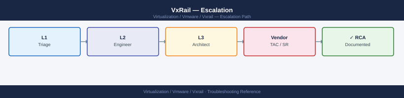

---
tags:
  - troubleshooting
  - vmware
  - vxrail
search:
  boost: 1.5
---
# VxRail — Escalation

<div class="kb-summary">
How to escalate Dell VxRail issues to Dell Technologies support: what data to collect, how to generate the VxRail support bundle, step-by-step case creation on dell.com/support, and the escalation path when progress stalls.

*Applies to: VxRail 7.x / 8.x*
</div>



---

```d2
direction: down

symptom: Identify Symptom {shape: diamond}
preescalation_selfcheck: "Pre-Escalation Self-Check" {shape: rectangle}
stepbystep_data_collection: "Step-by-Step Data Collection" {shape: rectangle}
how_to_open_the_case_on_dellcomsuppo: "How to Open the Case on dell.com/support" {shape: rectangle}
escalation_path: "Escalation Path" {shape: rectangle}
what_not_to_do: "What NOT to Do" {shape: rectangle}
useful_commands_for_case_updates: "Useful Commands for Case Updates" {shape: rectangle}
resolution: Resolve or Escalate {shape: oval}

symptom -> preescalation_selfcheck: investigate
symptom -> stepbystep_data_collection: investigate
symptom -> how_to_open_the_case_on_dellcomsuppo: investigate
symptom -> escalation_path: investigate
symptom -> what_not_to_do: investigate
symptom -> useful_commands_for_case_updates: investigate
preescalation_selfcheck -> resolution
stepbystep_data_collection -> resolution
how_to_open_the_case_on_dellcomsuppo -> resolution
escalation_path -> resolution
what_not_to_do -> resolution
useful_commands_for_case_updates -> resolution
```

## Before you begin

- **Access required:** vSphere Client access (admin credentials); SSH to VxRail Manager VM and ESXi hosts; iDRAC access to affected nodes; Dell support account at dell.com/support linked to the cluster's node service tags
- **Check SupportAssist first:** VxRail nodes have SupportAssist embedded in iDRAC; for hardware faults (disk, PSU, DIMM), a case may already exist. Check dell.com/support → My Cases before opening a duplicate
- **Do NOT retry a failed LCM upgrade** without Dell direction — an incomplete retry on a partially upgraded cluster can push nodes to three different software versions, making the cluster config inconsistent
- **Do NOT evacuate a degraded vSAN node** without Dell direction — evacuating when absent objects already exist can remove the last copy of a component

---

## Pre-Escalation Self-Check

Run these before opening the case.

| Check | Command / Location | Expected result |
|---|---|---|
| VxRail version | VxRail Plugin → System → Software Version | Note full version string |
| Cluster node health | vCenter → Cluster → Hosts | All nodes Connected |
| vSAN health overview | vCenter → Cluster → Monitor → vSAN → Health | All checks green |
| vSAN absent objects | vCenter → Cluster → Monitor → vSAN → Virtual Objects | Zero absent or degraded objects |
| LCM pre-check status | VxRail Plugin → Lifecycle Management → Last pre-check | All checks passed |
| iDRAC alerts | iDRAC UI → System → Overview | No critical hardware faults |
| SupportAssist case | dell.com/support → My Cases | No existing case for this fault |
| ESXi host uptime | `esxcli system stats uptime get` on each host | Consistent with known reboots |

---

## Step-by-Step Data Collection

### 1. Note the VxRail version and node service tags

```text
In vCenter vSphere Client:
  1. Click the VxRail plugin menu icon
  2. Navigate to System → Software Version → note the full VxRail version string
  3. Navigate to System → Cluster Info → note the cluster serial number
  4. Navigate to Hosts → select each node → Details → note the service tag (Dell hardware serial)
```

```bash
# Also available from ESXi shell on any node
esxcli system version get
```

### 2. Generate the VxRail support bundle

```text
In vCenter vSphere Client:
  1. Click the VxRail plugin menu icon
  2. Navigate to Support → Generate Support Bundle
  3. Wait for generation (5–15 minutes)
  4. Click Download and save the bundle to your workstation
```

This bundle contains: VxRail Manager logs, ESXi logs, vSAN state, LCM history, iDRAC events, and hardware inventory for all nodes.

### 3. Run vm-support on each affected ESXi host

```bash
# SSH to each affected ESXi host as root
ssh root@<esxi-host-ip>

# Generate the ESXi support bundle
vm-support

# Find the bundle (saved to /var/core/ or /scratch/)
ls -lh /var/core/
# Example: vm-support-esx-host01-2026-06-15--09.30.tar.gz

# Copy to workstation
scp root@<esxi-host>:/var/core/vm-support-*.tar.gz /tmp/
```

### 4. Export the iDRAC SEL (System Event Log)

```bash
# SSH to iDRAC of each affected node (or run from DRAC CLI)
racadm getsel > /tmp/idrac-sel-<service-tag>-$(date +%Y%m%d).txt

# Alternative: iDRAC web UI → iDRAC Settings → Lifecycle Log → Export
```

The SEL is the hardware event log — it shows disk faults, DIMM errors, PSU issues, and any hardware-triggered events that preceded the failure.

### 5. Capture vSAN health status

```bash
# SSH to any VxRail ESXi node
ssh root@<esxi-host-ip>

# vSAN health overview
esxcli vsan health cluster list

# vSAN object health (check for absent objects)
esxcli vsan health cluster view -t vsanobjectdatahealthsummary

# vSAN disk health
esxcli vsan health cluster view -t drivedatahealthsummary
```

### 6. Write the timeline

```text
VxRail version: 8.0.210-27074590
Cluster serial: VXR-XXXXXXXX
Nodes: 4 nodes (Node-01 through Node-04)
Service tags: XXXXXXX (Node-01), XXXXXXX (Node-02), XXXXXXX (Node-03), XXXXXXX (Node-04)
Issue first observed: 2026-06-15 08:00 UTC
Last confirmed healthy: 2026-06-15 06:00 UTC
Changes in 24h before the issue:
  - 06:00: LCM upgrade from 8.0.200 to 8.0.210 initiated
  - 07:30: LCM upgrade progress stalled at "Upgrading Node-02: ESXi firmware"
  - 08:00: Node-02 shows as Disconnected in vCenter; vSAN health shows "Absent objects" on 3 VMs
SupportAssist: No auto-case found for this incident
Steps already taken:
  - Did NOT retry the LCM upgrade
  - Did NOT evacuate Node-02
  - vSAN health: 3 absent objects on VMs hosted on Node-02
Blast radius: Node-02 offline; 3 VMs with absent vSAN objects; redundancy lost for those objects
```

---

## How to Open the Case on dell.com/support

1. Go to **dell.com/support** and sign in with your Dell account.

2. Click **My Cases** → **Create New Case**.

3. Under **Product**, enter the service tag of one of the affected nodes. Dell associates the case with the hardware by service tag.

4. Under **Product Category**, select **VxRail**.

5. Under **Severity**, select:
   - **Severity 1 — Production Down**: A node is offline with vSAN absent objects (data at risk); VxRail Manager is completely unreachable; LCM upgrade has left the cluster in an inconsistent mixed-version state; no workaround; data loss imminent
   - **Severity 2 — Degraded**: A node is degraded but not offline; vSAN is accessible but at reduced redundancy; LCM pre-check is failing and blocking upgrades; workaround partial
   - **Severity 3 — Non-Critical**: Single iDRAC alert; specific plugin feature broken; vSAN health warning but fully protected; workaround exists
   - **Severity 4 — General**: How-to question, pre-upgrade planning, capacity review

6. In the **Summary** field: symptom + scope. Example: `VxRail 8.0.210 — Node-02 offline after LCM upgrade, vSAN absent objects on 3 VMs, data at risk`.

7. In the **Description** field, paste:
   - VxRail version and cluster serial from Step 1
   - Node service tags for affected nodes
   - vSAN health status from Step 5
   - The timeline from Step 6
   - Any SupportAssist case number if one was auto-created

8. Under **Attachments**, upload:
   - VxRail support bundle from Step 2
   - vm-support bundles from affected ESXi hosts (Step 3)
   - iDRAC SEL exports from affected nodes (Step 4)

9. Click **Submit**. You receive a case number immediately.

10. **Severity 1 only:** call Dell support after submission:
    - North America: +1 800 945 3355 (24×7 for production-down)
    - State "Severity 1 — VxRail node offline, vSAN absent objects, data at risk, case XXXXXXXX" at the start of the call.

---

## Escalation Path

```text
Step 1 — Open case at dell.com/support with VxRail bundle + ESXi bundles + iDRAC SELs attached
         ↓
Step 2 — Dell T1 engineer acknowledges (P1: < 2 hr ProSupport Plus; P2: < 4 hr)
         ↓
Step 3 — If no meaningful progress within 2 hours for P1:
         → Reply in case: "Requesting escalation to VxRail Senior Engineer"
         → State: "[node offline / LCM failed / absent objects / Manager unreachable]"
         ↓
Step 4 — VxRail T2 Senior Engineer assigned
         → They will review the VxRail bundle and may request SSH to VxRail Manager
         → Have vSphere Client, VxRail plugin, and iDRAC access ready
         ↓
Step 5 — If issue requires hardware dispatch (failed node, disk, PSU):
         → Dell dispatches a field engineer with replacement hardware
         → Provide physical access details (data center, rack, unit position)
         ↓
Step 6 — For prolonged P1 or complex LCM/vSAN recovery:
         → Contact your Technical Account Manager (TAM) directly
         → For on-site senior engineering: request Global Priority Services (GPS)
```

---

## What NOT to Do

| Do NOT do this | Why | What to do instead |
|---|---|---|
| Retry a failed LCM upgrade without Dell guidance | An incomplete retry on a partially upgraded cluster can push nodes to three different software versions, making recovery much harder | Let Dell review the LCM logs and the current node version state before any retry |
| Evacuate a vSAN node that already has absent objects | Evacuating removes the physical node from vSAN's available copies; if absent objects have only one remaining copy, evacuation may reduce them to zero copies | Wait for Dell to confirm whether evacuation is safe given the current object health state |
| Remove or rebuild a failed node without Dell direction | Rebuilding destroys the node's vSAN disk group, which may hold the last remaining copy of an object | Let Dell confirm all object copies are healthy on other nodes before any node rebuild |
| Modify vSAN storage policies during the investigation | Changing policies triggers object rebuilds and changes the state Dell is diagnosing | Freeze all vSAN policy changes until Dell confirms the vSAN is healthy |
| Open a new case without checking SupportAssist first | A duplicate case splits the diagnostic history and delays the engineer who gets the second case | Check dell.com/support → My Cases and iDRAC → SupportAssist before creating a new case |
| Apply any firmware or software updates during the incident | Additional changes during an already-degraded state add variables and may make the cluster state worse | Freeze all firmware and software changes until Dell closes the P1 |

---

## Useful Commands for Case Updates

```bash
# SSH to any VxRail ESXi node as root — paste into every case update

# ESXi version
esxcli system version get

# vSAN cluster health (summary)
esxcli vsan health cluster list

# vSAN object health (absent objects)
esxcli vsan health cluster view -t vsanobjectdatahealthsummary

# Disk health
esxcli vsan health cluster view -t drivedatahealthsummary

# Host connectivity
esxcli network ip interface list | grep -E "vmk|Management"

# iDRAC SEL export (run per node)
racadm getsel | tail -30
```

---

## Support SLA Reference

| Tier | Severity | Definition | Initial Response SLA |
|---|---|---|---|
| ProSupport Plus | P1 — Production Down | Node offline; vSAN absent objects; data at risk; no workaround | < 2 hours (24×7) |
| ProSupport Plus | P2 — Degraded | Node degraded; vSAN accessible but reduced redundancy; LCM blocked | < 4 hours (24×7) |
| ProSupport Plus | P3 — Non-Critical | Single alert; specific plugin issue; workaround exists | Next business day |
| ProSupport Plus | P4 — General | How-to, planning, capacity review | Next business day |
| ProSupport | P1 | As above | < 4 hours (24×7) |

---

## See also

- [VxRail — Diagnostics](diagnostics/)
- [VxRail — Common Issues](common-issues/)

---

## Verify resolution

- vSphere Client shows all VxRail nodes as Connected with no warnings
- vCenter → Cluster → Monitor → vSAN → Health: all checks green
- vCenter → Cluster → Monitor → vSAN → Virtual Objects: zero absent or degraded objects
- VxRail Plugin → System → Software Version shows consistent version across all nodes
- If LCM was the issue: VxRail Plugin → Lifecycle Management shows the upgrade complete and pre-check passing
- Run `esxcli vsan health cluster list` on any node and confirm all checks green
- Monitor vSAN health for 15 minutes to confirm no objects transition to absent state
