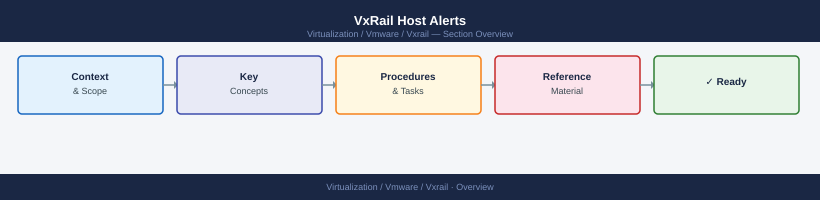

---
tags:
  - troubleshooting
  - vxrail
search:
  boost: 1.5
---
# VxRail Host Alerts

<div class="kb-summary">
VxRail Host Alerts reference covering Overview, Where It Fits, Daily Checks, Health Commands, Common Issues and 3 more sections.

*Applies to: VxRail 7.x / 8.x*
</div>



## Before you begin

- **Access:** SSH to vCenter Shell and ESXi hosts; vSphere Client read access
- **Gather first:** recent error message text, event timestamps, and affected object names
- **Scope:** confirm whether the issue affects a single object, host, cluster, or site
- **Escalation:** open a vendor support ticket before running any destructive step
- **Logging:** document each command and output — required if escalation is needed

---

## Overview

ESXi host warnings, disconnected hosts, hardware alerts, and cluster impact.

## Where It Fits

Use this page for VxRail operations, support checks, lifecycle work, troubleshooting, and change validation.

## Daily Checks

| Check | Command | Notes |
|---|---|---|
| Review VxRail Manager health. |  |  |
| Check vCenter and ESXi host health. |  |  |
| Review vSAN health. |  |  |
| Confirm no active failed tasks. |  |  |
| Review hardware alerts. |  |  |
| Check recent lifecycle or support events. |  |  |

## Health Commands

```bash
# Add environment-specific commands here
```

## Common Issues

- Lifecycle pre-check failure.
- Host hardware warning.
- vSAN health warning.
- Failed update bundle.
- VxRail Manager service issue.
- Version compatibility issue.
- Support bundle collection failure.

## Operational Tasks

| Task | Command |
|---|---|
| Review cluster health. |  |
| Validate node status. |  |
| Confirm support connectivity. |  |
| Check upgrade readiness. |  |
| Collect support evidence. |  |
| Document changes and follow-up items. |  |

## Upgrade Notes

- Confirm upgrade path.
- Review Dell compatibility guidance.
- Confirm vCenter, ESXi, vSAN, and firmware versions.
- Validate backups and rollback notes.
- Run post-upgrade checks.

## Best Practices

| Recommendation | Detail |
|---|---|
| Do not skip pre-checks. | Do not skip pre-checks. |
| Keep Dell and VMware versions aligned. | Keep Dell and VMware versions aligned. |
| Validate hardware health before lifecycle work. | Validate hardware health before lifecycle work. |
| Keep support bundle notes with the case. | Keep support bundle notes with the case. |
| Record post-change validation. | Record post-change validation. |

---

## Verify resolution

- Confirm the original symptom no longer occurs
- Check logs for any residual errors related to the issue
- Monitor for 10–15 minutes to confirm the fix is stable

## See also

- [VxRail — Common Issues](common-issues/)
- [VxRail — Diagnostics](diagnostics.md)
- [VxRail — Escalation](escalation.md)
- [VxRail Troubleshooting](index.md)
- [VxRail — Architecture](../architecture/)
- [VxRail — Deploy](../deploy/)
- [VxRail Operations](../operations/)
- [VxRail Security](../security/)
