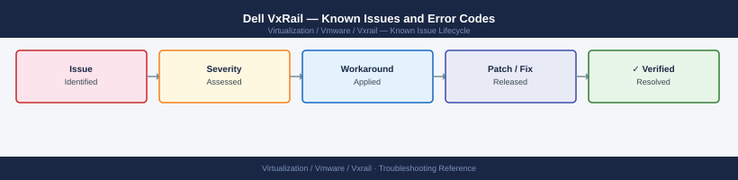

---
tags:
  - troubleshooting
  - vxrail
  - dell
  - vmware
  - known-issues
---
# Dell VxRail — Known Issues and Error Codes

<div class="kb-summary">
Catalog of known VxRail bugs, error codes, and workarounds covering LCM upgrades, iDRAC, VxRail Manager, and vSphere integration.

*Applies to: VxRail 7.x / 8.x*
</div>



```d2
direction: down

symptom: Identify Symptom {shape: diamond}
lcm_upgrade: "LCM / Upgrade" {shape: rectangle}
vxrail_manager: "VxRail Manager" {shape: rectangle}
hardware_idrac: "Hardware / iDRAC" {shape: rectangle}
vsphere_integration: "vSphere Integration" {shape: rectangle}
resolution: Resolve or Escalate {shape: oval}

symptom -> lcm_upgrade: investigate
symptom -> vxrail_manager: investigate
symptom -> hardware_idrac: investigate
symptom -> vsphere_integration: investigate
lcm_upgrade -> resolution
vxrail_manager -> resolution
hardware_idrac -> resolution
vsphere_integration -> resolution
```

## Before you begin

- VxRail issues are tracked at `dell.com/support` and in the VxRail Release Notes for your specific appliance type.
- LCM (Lifecycle Manager) upgrade failures are the most common issue — always check the `vsanmgmt.log` and `/var/log/vmware/vxrail/` directory on VxRail Manager.
- Run `mystic show cluster health` on the VxRail Manager VM for cluster-level diagnostics.

## LCM / Upgrade

| Error / Symptom | Affected Versions | Cause | Workaround / Fix | Fixed In |
|---|---|---|---|---|
| LCM upgrade fails at `Upgrading iDRAC` | VxRail 7.x | iDRAC firmware mismatch with target bundle | Re-run LCM; if persistent, update iDRAC manually via RACADM and re-trigger | N/A |
| LCM stuck at 40% — `Precheck failed: DRS disabled` | VxRail 7.x / 8.x | DRS set to Manual instead of Fully Automated | Set DRS to Fully Automated before LCM; revert after if needed | N/A |
| LCM health check fails: `VxRail Manager unreachable` | VxRail 7.x | VxRail Manager VM migrated off its pinned host | Ensure VxRail Manager VM is DRS pinned to node it originally deployed on | N/A |
| LCM reports `Signature validation failed` for bundle | VxRail 7.x | Bundle downloaded from *.dell.com with corruption | Delete bundle from LCM depot; re-download with checksum verification | N/A |

## VxRail Manager

| Error / Symptom | Affected Versions | Cause | Workaround / Fix | Fixed In |
|---|---|---|---|---|
| VxRail Manager UI inaccessible after reboot | VxRail 7.x | `mystic` service not started cleanly | SSH to VxRail Manager: `service mystic restart` | N/A |
| `Day-2 operation failed` for node expansion | VxRail 7.x / 8.x | New node iDRAC not reachable from VxRail Manager | Verify iDRAC network segment matches existing nodes; check VxRail Manager static route | N/A |

## Hardware / iDRAC

| Error / Symptom | Affected Versions | Cause | Workaround / Fix | Fixed In |
|---|---|---|---|---|
| iDRAC shows `Critical` on cache vault but vSAN healthy | VxRail 7.x | Cache vault capacitor warning threshold too low for operating temperature | Apply iDRAC firmware update; check ambient temperature | N/A |
| NVMe device not recognized after hot-swap | VxRail 7.x | Hot-swap not supported on all NVMe backplane types | Reboot host to re-detect NVMe device; check VxRail HCL for hot-swap support | N/A |

## vSphere Integration

| Error / Symptom | Affected Versions | Cause | Workaround / Fix | Fixed In |
|---|---|---|---|---|
| VxRail plug-in disappears from vSphere client after VCSA upgrade | VxRail 7.x | Plug-in registration invalidated by VCSA upgrade | Re-register VxRail plug-in: run `python3 /opt/vmware/vxrail/plugin_registration.py` on VxRail Manager | N/A |

## See also

- [Dell VxRail — Common Issues](../common-issues/)
- [VMware vCenter — Known Issues](../../vcenter/troubleshooting/known-issues.md)
- [VMware vSAN — Known Issues](../../vsan/troubleshooting/known-issues.md)
