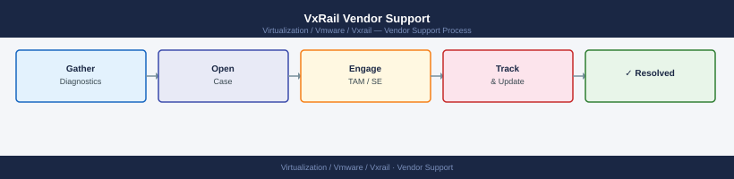
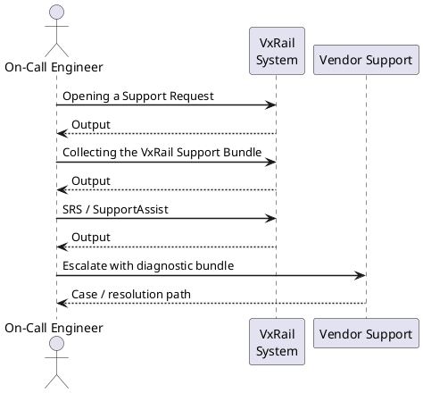

---
tags:
  - vxrail
---
# VxRail Vendor Support


<div class="kb-summary">
VxRail vendor support: Dell SupportAssist case creation, `mystic` diagnostic bundle collection, Secure Remote Services (SRS) connectivity, and engineering escalation path.

*Applies to: VxRail 7.x · 8.x*
</div>



---



## Opening a Support Request

Dell support for VxRail is accessed via the Dell support portal. Service requests are opened against the cluster service tag or an individual node service tag.

1. Navigate to the Dell support portal.
2. Search by service tag (cluster or node) — confirms warranty and support level.
3. Select **VxRail** as the product line.
4. Choose the appropriate category: software (VxRail Manager, ESXi, vSAN), hardware (node failure, disk, PSU), or networking.

**Required information for every VxRail SR:**

- VxRail bundle version (VxRail Manager → System → Software Versions)
- Affected node service tag(s)
- Cluster size and configuration (all-flash, NVMe, etc.)
- Description of the issue with timestamps
- VxRail support bundle (see below)

---

## Collecting the VxRail Support Bundle

The support bundle collects logs from all nodes, vCenter, VxRail Manager, and vSAN traces in a single operation.

```text
VxRail Manager UI → System → Support → Generate Support Bundle
→ Select all nodes → Generate
→ Download the bundle once complete (may take 10–20 minutes for large clusters)
```

**Bundle contents:**

- VxRail Manager application logs
- ESXi host logs (hostd, vmkernel, vpxa) for each node
- vSAN health and trace data
- vCenter events and alarms
- Hardware event logs from iDRAC for each node

**Alternative — individual node bundle via ESXi:**

```bash
# SSH to the ESXi host directly
vm-support -w /tmp
# SCP the output off the host
scp root@<esxi-ip>:/tmp/esx-<hostname>-*.tgz <destination>
```

---

## SRS / SupportAssist

SupportAssist (formerly Secure Remote Services) auto-generates Dell support cases for hardware faults detected by iDRAC.

**Verify SupportAssist is active:**

```text
VxRail Manager UI → System → Support → SupportAssist
→ Status should show: Connected
→ Check Last Heartbeat timestamp — should be within 24 hours
```

**Test SupportAssist:**

```text
VxRail Manager → System → Support → SupportAssist → Run Test
→ Confirm a test SR appears in the Dell support portal within a few minutes
```

If SupportAssist shows disconnected, check:
1. Outbound HTTPS access from VxRail Manager to Dell SupportAssist endpoints
2. Proxy configuration if applicable (VxRail Manager → System → Network → Proxy)

---

## Escalation Path

| Level | Action |
|---|---|
| Standard SR | Opens automatically (SupportAssist) or via portal |
| Priority escalation | In the open SR → **Request Escalation** → provide business impact |
| Engineering escalation | In the SR → **Request Engineering Escalation** → for bugs blocking production |
| Account team | Contact Dell account team for critical production outages if SR response is insufficient |

---

## Version Compatibility Matrix

Before any lifecycle operation, verify the target VxRail bundle version against the VxRail Compatibility Matrix:

```text
Dell Technologies Interoperability Matrix (IMT)
→ Select VxRail → current version → check compatible vSphere, vSAN, NSX versions
```

Also check for any VxRail-specific release notes or known issues before applying an LCM bundle — some bundles have prerequisites or known issues documented in the release notes.

---

## Useful Support Commands

```bash
# Check VxRail Manager version from the appliance
ssh vcf@<vxrail-manager-ip>
cat /etc/vxrail-release

# Check ESXi version on a node
vmware -v

# Check all node service tags from VxRail Manager CLI
vxrail-system-info --node-list

# Check iDRAC for hardware events on a node
racadm getsel   # System Event Log (hardware alerts)
```
