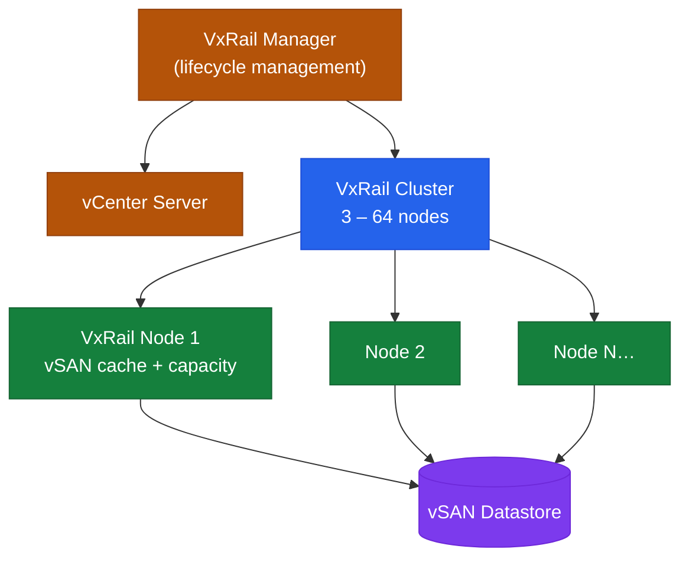

# VxRail — Cluster Software Stack and Data Plane

```text
┌─────────────────────────────────────────────────────────────┐
│  VxRail Manager (VM on cluster)                                                                       │
│  LCM Engine · vCenter plugin · REST API · Health monitor                                              │
└───────────────┬─────────────────────────────────────────────┘
```
```text
┌─────────────────────────── VxRail — Cluster Software Stack and Data Plane ────────────────────────────┐
│                                                                                                       │
│    Every VxRail node runs the same layered stack; vSAN spans all nodes to form a                      │
│    shared datastore. vSphere cluster features (HA, DRS) operate across all nodes.                     │
│                                                                                                       │
│   ┌──────────────────────────────────────────────┐  ┌─────────────────────────────────────────────┐   │
│   │           Per-Node Software Stack            │  │            Cluster-Level Services           │   │
│   │      VMkernel (ESXi type-1 hypervisor)       │  │        vCenter: cluster control plane       │   │
│   │         VMs: guest workloads in VMs          │  │         HA: restart on host failure         │   │
│   │     vSAN: local disk contributes to pool     │  │         DRS: rebalance across hosts         │   │
│   │       vDS: distributed virtual switch        │  │     vSAN: policy-based RAID across nodes    │   │
│   │       VxRail Manager plugin (vCenter)        │  │     VxRail Manager: single pane of glass    │   │
│   └──────────────────────────────────────────────┘  └─────────────────────────────────────────────┘   │
│                                                                                                       │
│    vSAN writes are synchronous across N nodes per the SPBM policy (FTT=1 → 2 copies).                 │
│                                                                                                       │
│                          ▼                                                 ▼                          │
│                                                                                                       │
│   ┌──────────────────────────────────────────────┐  ┌─────────────────────────────────────────────┐   │
│   │          vSAN I/O Path (per write)           │  │            Network VMkernel Ports           │   │
│   │            VM guest write → VMDK             │  │       vmk0: management (iDRAC mirror)       │   │
│   │        vSAN kernel module intercepts         │  │       vmk1: vMotion (VM live migrate)       │   │
│   │         SPBM policy → FTT/RAID type          │  │     vmk2: vSAN (storage traffic MTU 9k)     │   │
│   │       Write to local + remote witness        │  │       vmk3: NSX TEP (if NSX deployed)       │   │
│   │         ACK to guest on quorum write         │  │         VM uplink: workload traffic         │   │
│   └──────────────────────────────────────────────┘  └─────────────────────────────────────────────┘   │
│                                                                                                       │
│    Physical Infrastructure (the hardware everything above runs on):                                   │
│    VxRail nodes: Intel/AMD CPU · NVMe cache + SSD/HDD capacity · 25/100GbE NIC                        │
│                                                                                                       │
│    Key terms:                                                                                         │
│                                                                                                       │
│    VMkernel      = ESXi type-1 hypervisor kernel; manages CPU, memory, I/O for all VMs                │
│    SPBM          = Storage Policy Based Management; per-VMDK FTT and RAID type rules                  │
│    FTT           = Failures To Tolerate; FTT=1 requires 3 nodes minimum for full RAID                 │
│    Witness       = Tiebreaker node or VM; holds metadata only, no data; for FTT=1                     │
│    vDS           = vSphere Distributed Switch; managed from vCenter across all nodes                  │
│    vmk           = VMkernel port; ESXi IP endpoint for management/vSAN/vMotion/NSX TEP                │
│                                                                                                       │
└───────────────────────────────────────────────────────────────────────────────────────────────────────┘
```
```python

## Overview

VxRail is a hyper-converged infrastructure (HCI) appliance built on Dell PowerEdge nodes running VMware vSphere and vSAN. Each node contributes local compute (CPU, RAM), NVMe flash cache, and capacity storage to a unified cluster. VxRail Manager orchestrates all lifecycle and configuration operations by communicating with vCenter.

VxRail is sold exclusively as a pre-configured appliance and managed as a system — firmware updates, vSphere upgrades, and vSAN configuration changes all go through the VxRail Manager lifecycle workflow, never independently.

## HCI Node Cluster

```


