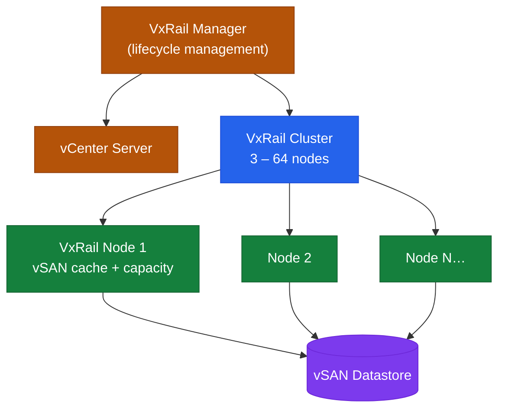

# VxRail — How It Works


<div class="kb-summary">
How It Works reference covering Overview, HCI Node Cluster, Cluster Topology, Node Components, VMkernel Network Design and 3 more sections.
</div>

VxRail LCM Flow — How It Works
```text
┌─────────────────────────────────────────────────────────────┐
│  VxRail Manager (VM on cluster)                                                                       │
│  LCM Engine · vCenter plugin · REST API · Health monitor                                              │
└───────────────┬─────────────────────────────────────────────┘
```
                │ orchestrates
    ┌───────────▼──────────────────────────────────────┐
    │  vSAN (built on top of ESXi node storage)         │
    │  disk groups: 1 cache device + 1–7 capacity devs  │
    │  FTT policy enforced across the cluster            │
    └───────────┬──────────────────────────────────────┘
                │
    ┌───────────▼──────────────────────────────────────┐
    │  LCM Upgrade Flow                                  │
    │  Upload Bundle → Validate → Plan → Execute         │
    │       │                               │            │
    │  Composite Bundle              node-by-node:       │
    │  (vSphere + vSAN +         evacuate → MM → update  │
    │   firmware + VxRail)        → reboot → exit MM     │
    └──────────────────────────────────────────────────┘
                │
    ┌───────────▼──────────────────────────────────────┐
    │  Management Plane                                  │
    │  VxRail Mgr  ──►  vCenter  ──►  NSX (optional)   │
    │      │                                             │
    │  iDRAC (per node)  ──►  hardware health           │
    │  Dell SRS/SupportAssist ──►  auto SR creation     │
    └──────────────────────────────────────────────────┘
```python

## Overview

VxRail is a hyper-converged infrastructure (HCI) appliance built on Dell PowerEdge nodes running VMware vSphere and vSAN. Each node contributes local compute (CPU, RAM), NVMe flash cache, and capacity storage to a unified cluster. VxRail Manager orchestrates all lifecycle and configuration operations by communicating with vCenter.

VxRail is sold exclusively as a pre-configured appliance and managed as a system — firmware updates, vSphere upgrades, and vSAN configuration changes all go through the VxRail Manager lifecycle workflow, never independently.

## HCI Node Cluster



## Cluster Topology

| Parameter | Value |
|---|---|
| Minimum cluster size | 3 nodes (FTT=1 vSAN RAID-1 or RAID-5 with 4+ nodes) |
| Maximum cluster size | 64 nodes |
| Node types | All-flash, NVMe, hybrid (spinning + cache tier) |
| Dedicated management nodes | Optional — separate nodes for vCenter and management VMs |
| Stretched cluster | 2 data sites + 1 witness; requires stretched vSAN |

## Node Components

Each VxRail node is a PowerEdge server with:

- CPU: Intel Xeon Scalable (generation dependent on appliance model)
- RAM: Configurable per node SKU (up to 6 TB on high-end)
- Cache tier: NVMe or SSD dedicated for vSAN cache
- Capacity tier: NVMe or SSD for vSAN persistent storage
- Network: Dual-port 10/25 GbE or 100 GbE (configurable per SKU)
- Management: Dedicated iDRAC port

## VMkernel Network Design

| Traffic Type | VMkernel | Purpose |
|---|---|---|
| Management | vmk0 | ESXi management, vCenter communication |
| vMotion | vmk1 | Live VM migration between nodes |
| vSAN | vmk2 | vSAN storage traffic between nodes |
| VxRail Management | vmk3 | VxRail Manager internal communication |
| VM traffic | Portgroups | VM network connectivity (NSX overlay or standard VLANs) |

All network configuration is managed through the VDS (vSphere Distributed Switch) — not individual host vSwitches.

## Storage Layer (vSAN)

vSAN pools all nodes' local storage into a single distributed datastore:

- **Disk groups**: each node has 1+ disk groups (1 cache device + 1–7 capacity devices)
- **Storage policy**: VMs assigned FTT=1 (1 failure tolerance) or FTT=2 (2 failures)
- **Deduplication and compression**: optional cluster-wide; reduces effective capacity
- **Encryption**: vSAN data-at-rest encryption via external KMS (optional)
- **ESA (Express Storage Architecture)**: available on newer models — single-tier NVMe, simplified disk group model, improved performance

## Management Plane

| Component | Deployment |
|---|---|
| VxRail Manager | VM running on the cluster itself |
| vCenter | Embedded (runs on VxRail) or external |
| NSX Manager | External — recommended for production |
| Aria Operations | External; connects via VxRail management pack |

VxRail Manager communicates with Dell iDRAC (hardware health), vCenter (cluster inventory and lifecycle), and Dell SRS/SupportAssist (automatic SR creation on hardware faults).

## Lifecycle Management

All upgrades (vSphere, vSAN, VxRail Manager, firmware) go through the VxRail Manager LCM workflow:

1. Upload the VxRail Composite Bundle (matched versions of all components) to VxRail Manager
2. VxRail Manager validates compatibility and generates an upgrade plan
3. Upgrade executes node-by-node (rolling) — each node enters maintenance mode, upgrades, then exits before the next begins
4. Full cluster upgrade time scales with node count and workload evacuation time

**Never upgrade vSphere, vSAN, or firmware independently** — all component versions must remain within the certified VxRail bundle matrix.
