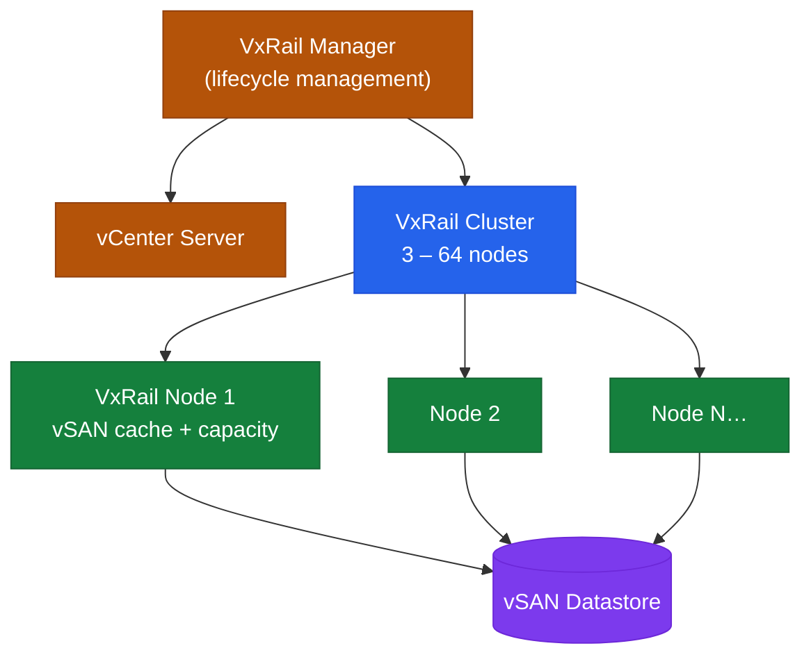

---
tags:
  - architecture
  - vxrail
---
# VxRail — Architecture

VxRail architecture overview — node hardware, HCI cluster topology, vSAN disk groups, and management stack integration.

<a class="kb-card" href="how-it-works/"><strong>How It Works</strong>How it works, integrations, and design standards.</a>
<a class="kb-card" href="../integration/"><strong>Integration</strong>Integration with vCenter, NSX, Aria Operations, and Dell SupportAssist.</a>
<a class="kb-card" href="../design-standards/"><strong>Design Standards</strong>Sizing, VMkernel network design, vSAN policy, and cluster configuration best practices.</a>

## Cluster Topology

| Parameter | Value |
|---|---|
| Minimum cluster size | 3 nodes (FTT=1 vSAN RAID-1 or RAID-5 with 4+ nodes) |
| Maximum cluster size | 64 nodes |
| Node types | All-flash, NVMe, hybrid (spinning + cache tier) |
| Dedicated management nodes | Optional — separate nodes for vCenter and management VMs |
| Stretched cluster | 2 data sites + 1 witness; requires stretched vSAN |

## HCI Node Cluster

