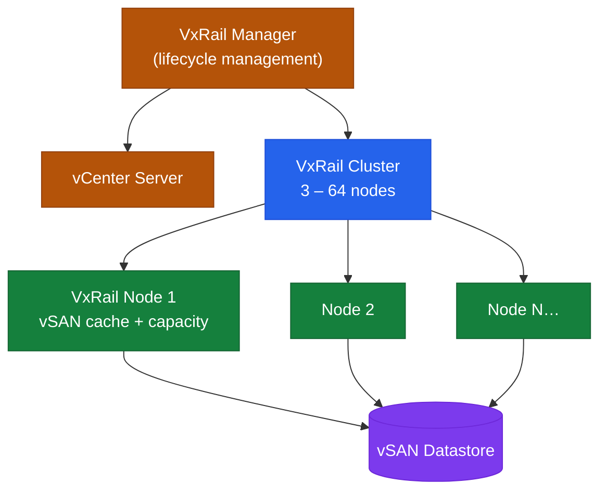

# VxRail Architecture

> Part of the [VxRail](../) reference.

---
## Overview

VxRail is a hyper-converged infrastructure (HCI) appliance built on Dell PowerEdge nodes running VMware vSphere and vSAN. Each node contributes local compute (CPU, RAM), NVMe flash cache, and capacity storage to a unified cluster. VxRail Manager orchestrates all lifecycle and configuration operations by communicating with vCenter.

VxRail is sold exclusively as a pre-configured appliance and is managed as a system — firmware updates, vSphere upgrades, and vSAN configuration changes all go through the VxRail Manager lifecycle workflow, not independently.

---

## HCI Node Cluster

## Cluster Topology

| Parameter | Value |
|---|---|
| Minimum cluster size | 3 nodes (FTT=1 vSAN RAID-1 or RAID-5 with 4+ nodes) |
| Maximum cluster size | 64 nodes |
| Node types | All-flash, NVMe, hybrid (spinning + cache tier) |
| Dedicated management nodes | Optional — separate nodes for vCenter and management VMs |
| Stretched cluster | 2 data sites + 1 witness; requires stretched vSAN |

---

## Node Components

Each VxRail node is a PowerEdge server with:
- CPU: Intel Xeon Scalable (generation dependent on appliance model)
- RAM: Configurable per node SKU (256GB–6TB per node for high-end)
- Cache tier: NVMe or SSD dedicated for vSAN cache
- Capacity tier: NVMe or SSD for vSAN persistent storage
- Network: Dual-port 10/25GbE or 100GbE (configurable per SKU)
- Management: Dedicated iDRAC port

---

## Network Design

VxRail uses separate VMkernel adapters for each traffic type, typically on dedicated VLANs:

| Traffic Type | VMkernel | Purpose |
|---|---|---|
| Management | vmk0 | ESXi management, vCenter communication |
| vMotion | vmk1 | Live VM migration between nodes |
| vSAN | vmk2 | vSAN storage traffic between nodes |
| VxRail Management | vmk3 | VxRail Manager internal communication |
| VM traffic | Portgroups | VM network connectivity (NSX overlay or standard VLANs) |

VxRail initially supports VDS (vSphere Distributed Switch) — all network configuration is managed through the VDS, not individual host vSwitches.

---

## Storage Layer (vSAN)

vSAN uses all nodes' local storage pooled into a distributed datastore:

- **Disk groups:** Each node has one or more disk groups (1 cache device + 1–7 capacity devices)
- **Storage policy:** VMs are assigned a storage policy (FTT=1 for 1 failure tolerance, FTT=2 for 2)
- **Deduplication and compression:** Optional cluster-wide; reduces effective capacity for deduplicated workloads
- **Encryption:** vSAN data-at-rest encryption via external KMS integration (optional)

vSAN Express Storage Architecture (ESA) is available on newer VxRail models — uses a single-tier NVMe design with improved performance and a simplified disk group model.

---

## Management Plane

| Component | Deployment |
|---|---|
| VxRail Manager | VM running on the cluster itself |
| vCenter | Can be embedded (runs on VxRail) or external |
| NSX Manager | External deployment recommended for production |
| Aria Operations | External; connects via VxRail management pack |

**VxRail Manager** runs as an appliance VM and communicates with:
- Dell iDRAC for hardware health
- vCenter for cluster inventory and lifecycle operations
- Dell SRS/SupportAssist for automatic SR creation on hardware faults

---

## Lifecycle Management

All upgrades (vSphere, vSAN, VxRail Manager, firmware) are coordinated through VxRail Manager's **LCM (Lifecycle Management)** workflow:

1. Upload the VxRail Composite Bundle (contains matched versions of all components) to VxRail Manager.
2. VxRail Manager validates compatibility and generates an upgrade plan.
3. Upgrade executes node-by-node (rolling update), placing each node in maintenance mode, upgrading, and then exiting maintenance before moving to the next.
4. Full cluster upgrade time scales with number of nodes and workload evacuation time.

**Never upgrade vSphere, vSAN, or firmware independently on VxRail** — all component versions must remain within the tested and certified VxRail bundle matrix.
