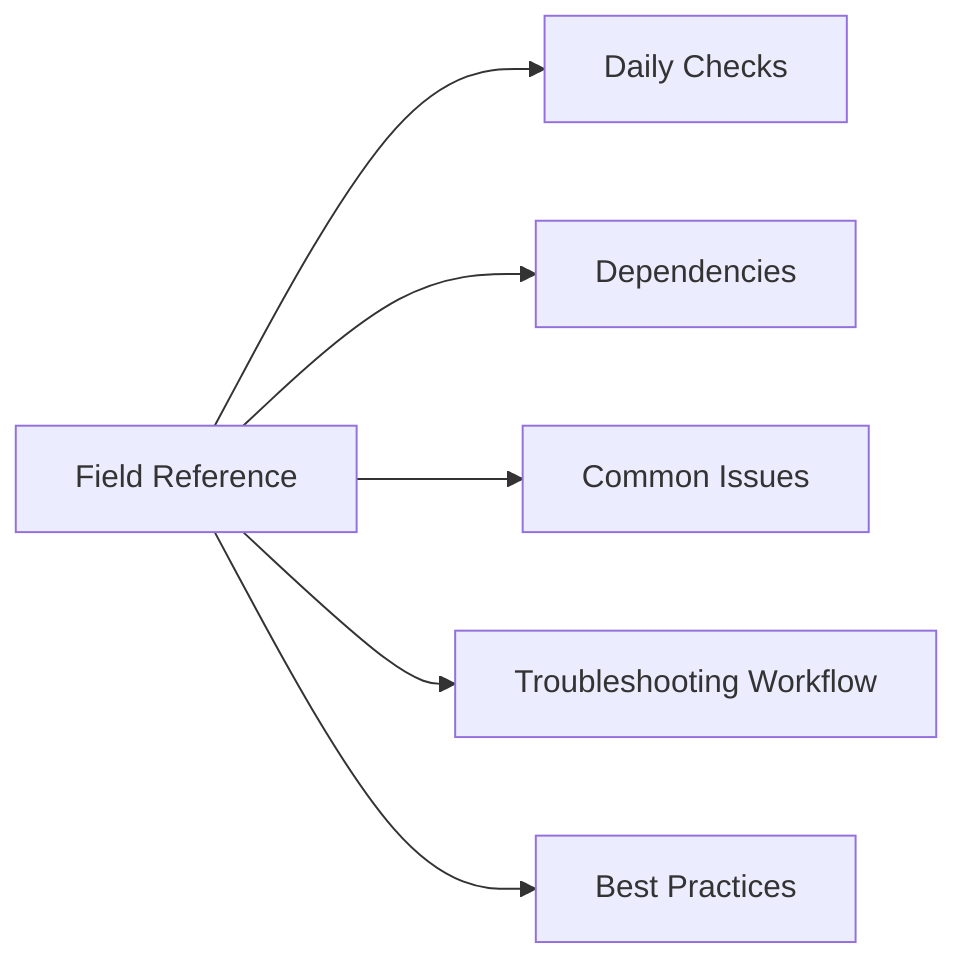

# VxRail Field Reference

## Overview

Core operational reference for VxRail infrastructure.

## Daily Checks

| Check | Command | Notes |
|---|---|---|
| Review alerts |  |  |
| Confirm services healthy |  |  |
| Check capacity |  |  |
| Validate connectivity |  |  |
| Review recent changes |  |  |

## Dependencies

- DNS
- NTP
- Authentication
- Network connectivity
- Storage availability
- Monitoring
- Backup

## Common Issues

- Service failure
- Certificate expiration
- Capacity pressure
- Network issue
- Authentication issue

## Troubleshooting Workflow

1. Confirm scope
2. Review alerts
3. Check logs
4. Validate dependencies
5. Escalate with evidence

## Best Practices

| Recommendation | Detail |
|---|---|
| Keep versions aligned | Keep versions aligned |
| Maintain monitoring | Maintain monitoring |
| Validate changes | Validate changes |
| Document ownership | Document ownership |
