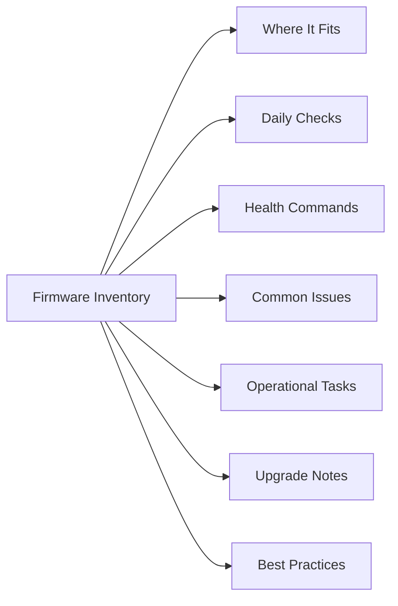

# VxRail Firmware Inventory

## Overview

Firmware versions, drift review, lifecycle alignment, and upgrade notes.

## Where It Fits

Use this page for VxRail operations, support checks, lifecycle work, troubleshooting, and change validation.

## Daily Checks

| Check | Command | Notes |
|---|---|---|
| Review VxRail Manager health. |  |  |
| Check vCenter and ESXi host health. |  |  |
| Review vSAN health. |  |  |
| Confirm no active failed tasks. |  |  |
| Review hardware alerts. |  |  |
| Check recent lifecycle or support events. |  |  |

## Health Commands

~~~bash
# Add environment-specific commands here
~~~

## Common Issues

- Lifecycle pre-check failure.
- Host hardware warning.
- vSAN health warning.
- Failed update bundle.
- VxRail Manager service issue.
- Version compatibility issue.
- Support bundle collection failure.

## Operational Tasks

| Task | Command |
|---|---|
| Review cluster health. |  |
| Validate node status. |  |
| Confirm support connectivity. |  |
| Check upgrade readiness. |  |
| Collect support evidence. |  |
| Document changes and follow-up items. |  |

## Upgrade Notes

- Confirm upgrade path.
- Review Dell compatibility guidance.
- Confirm vCenter, ESXi, vSAN, and firmware versions.
- Validate backups and rollback notes.
- Run post-upgrade checks.

## Best Practices

| Recommendation | Detail |
|---|---|
| Do not skip pre-checks. | Do not skip pre-checks. |
| Keep Dell and VMware versions aligned. | Keep Dell and VMware versions aligned. |
| Validate hardware health before lifecycle work. | Validate hardware health before lifecycle work. |
| Keep support bundle notes with the case. | Keep support bundle notes with the case. |
| Record post-change validation. | Record post-change validation. |
