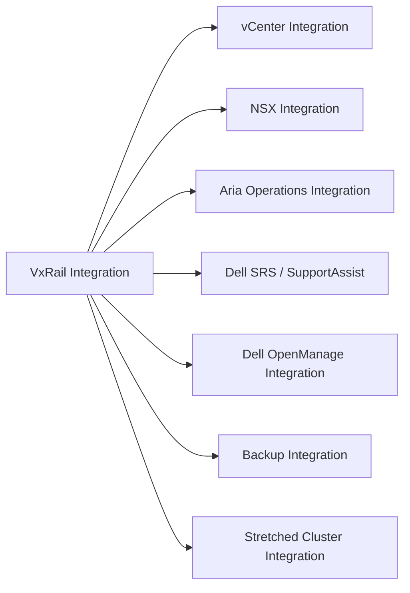

# VxRail Integration

> Part of the [VxRail](../) reference.

---

## vCenter Integration

VxRail Manager registers as a vCenter plugin, surfacing cluster health, node status, and lifecycle management directly within the vSphere Client.

- Navigate to **VxRail** in the vSphere Client left-hand menu to access the VxRail Manager UI.
- Hardware health for each node (PSU, fans, drives, NICs) is visible per-node under the VxRail Cluster view.
- Upgrade workflows are initiated from within vCenter via the VxRail plugin — no separate browser access to VxRail Manager is required for most operations.

**VxRail Manager local UI** (for break-glass or upgrade operations): `https://<vxrail-manager-ip>` — default credentials configured during initial deployment.

---

## NSX Integration

VxRail is fully compatible with NSX-T as the software-defined networking layer for VM traffic. NSX Manager points to the vCenter managing the VxRail cluster.

**Host preparation** (installing NSX agents on ESXi nodes) is triggered from NSX Manager:

- System → Fabric → Hosts → Add Host (or configure via Transport Node Profile)
- NSX deploys VIBs to each ESXi node; this requires the host to be in non-maintenance mode
- TEP (Tunnel Endpoint) VMkernel adapters are created automatically per the transport node profile

For VxRail clusters running NSX, all overlay (east-west) VM traffic uses GENEVE encapsulation over the vSAN/vMotion VLAN or a dedicated TEP VLAN.

**VxRail LCM and NSX:** VxRail Composite Bundle upgrades include NSX VIB versions tested for compatibility. Do not independently upgrade NSX host components on VxRail nodes.

---

## Aria Operations Integration

The VxRail management pack for Aria Operations (vROps) provides:

- Node-level hardware metrics (CPU, memory, storage controller, NIC)
- vSAN performance and capacity metrics per cluster
- VxRail Manager alerts and health state

**Install and configure:**

1. Download the VxRail management pack from Dell or VMware solution exchange.
2. In Aria Operations: Administration → Solutions → Import Management Pack.
3. Add a VxRail account: provide VxRail Manager IP and credentials.
4. Configure alerting thresholds for disk failure, capacity, and node health.

---

## Dell SRS / SupportAssist

SupportAssist (formerly SRS — Secure Remote Services) is configured during initial VxRail deployment. It monitors iDRAC hardware events and automatically opens Dell support cases for hardware faults.

**Verify SupportAssist is active:**

1. In VxRail Manager UI → Support → SupportAssist status.
2. Confirm "Connected" state and last heartbeat time.
3. Run a test event to confirm a case is opened in the Dell support portal.

If SupportAssist is not connected, VxRail hardware failures will not auto-generate SRs — manual monitoring and SR creation is required.

---

## Dell OpenManage Integration

Dell OpenManage Enterprise (OME) can inventory and monitor VxRail node hardware independently of VxRail Manager.

- Add VxRail nodes to OME using iDRAC IPs.
- OME provides hardware warranty status, firmware inventory, and hardware alerts.
- OME does not replace VxRail Manager for lifecycle operations — use OME for hardware asset management and iDRAC alerting only.

---

## Backup Integration

VxRail-hosted VMs are backed up like any vSphere VM. Common integrations:

**Veeam B&R:**
- Add the vCenter managing VxRail as a Managed Server in Veeam.
- VxRail-hosted VMs appear in the Veeam inventory and can be added to backup jobs.
- Veeam backup proxies should have access to the vSAN datastore via the vCenter NBD (Network Block Device) mode if no additional proxy is deployed inside the cluster.

**NetBackup / Commvault:**
- Similarly connect via vCenter; the hypervisor backup method (agentless) is used for most VMs.

---

## Stretched Cluster Integration

For VxRail stretched cluster configurations (two data sites + witness):

- vSAN stretched cluster policy (FTT=1, PFTT=1) ensures data is written synchronously to both sites.
- vCenter uses Host Groups and VM-Host Affinity rules to prefer primary site placement.
- NSX-T supports stretched clusters by deploying edge nodes at both sites with the same logical segments.
- VxRail Manager manages the stretched cluster as a single cluster entity — both sites are visible in one cluster view.
