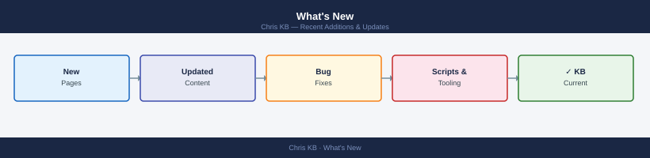

---
tags:
  - meta
search:
  boost: 2
---
# What's New

<div class="kb-summary">
Recent additions and updates to the knowledge base. Major changes by date — newest first.

*Auto-updated from commit history.*
</div>



```d2
direction: right

center: "System" {shape: hexagon}
june_2026: "June 2026" {shape: rectangle}

center -> june_2026
```

## June 2026

### 2026-06-21 — Full SVG coverage: every page now has a diagram

All 2,639 pages now have at least one SVG diagram. New scripts generate section-overview diagrams for every landing page, subsection card-nav page, and content page across all products and page types.

**New scripts:** `generate_svgs_remaining.py`, `generate_svgs_content.py`, `generate_svgs_learning.py`
**Total SVGs:** 3,385

---

### 2026-06-21 — Architecture page SVG coverage

Added SVGs to all `how-it-works.md`, `design-standards.md`, and `integrations.md` pages across all 54 products (161 SVGs).

---

### 2026-06-21 — Content coverage expansion

- **ONTAP Deploy guide** — full 7-phase deployment from physical racking to validated cluster
- **6 product procedure fills** — SnapMirror, SnapCenter, FlashBlade, PowerScale, Fabric-OS, PowerStore

---

### 2026-06-21 — SVG expansion project complete

1,385 SVGs added across procedures, health-checks, security, and troubleshooting pages for all products. Site audit: 37/37 checks clean.

---

### 2026-06-18 — KB Spectacular project complete

All 7 tracks shipped:

| Track | What |
|---|---|
| Tags | Every page tagged; tag cloud on index |
| Cheat sheets | 15 VMware CLI quick-reference pages |
| Interaction map | VMware product relationship map |
| Decision trees | 4 Mermaid troubleshooting flowcharts |
| Glossary | 155+ term full-stack glossary |
| Version matrix | 65+ feature/version compatibility table |
| Lab guides | 4 nested VMware lab walkthroughs |

---

### 2026-06-17 — Site audit expanded to 37 checks

Added Checks 29–37 covering heading hierarchy, broken links, anchor fragments, "See Also" validity, "Verify" sections on procedures pages, and health-check "Run This Routine" blocks.

Fixed 453 broken See Also links, 63 heading hierarchy violations, and 22 untagged pages.

---

### 2026-06-17 — Procedure depth: VMware products

Added missing procedures across vCenter, ESXi, NSX, VxRail, SRM, Aria stack, Horizon, Tanzu, VCF, and PowerCLI. Coverage target: every common admin task documented.

---

### 2026-06-16 — Known issues audit complete

Replaced all 71 placeholder diagrams with real product-specific known-issues diagrams across 91 pages.

---

### 2026-06-16 — Orphaned section merge

142 pages merged into correct product sections. Check 22 (orphan detection) verified clean.

---

### 2026-06-16 — New platform sections

OpenShift, EVS, and Ceph sections built (25 files each, full template structure).

---

### 2026-06-15 — Cross-references added

"## See also" added to 83 non-card-nav content pages across security, storage, networking, compute, backup, cloud, and certifications sections.

---

### 2026-06-13 — KB Usability project complete

All 8 tracks done: copy buttons, version labels, prerequisites, success criteria, diagnostic flowcharts, cross-references, morning health-check runbook, risk warnings.

---

## See also

- [Site Quality](site-quality.md)
- [Glossary](reference/glossary/index.md)
- [Version Matrix](reference/versions/index.md)
